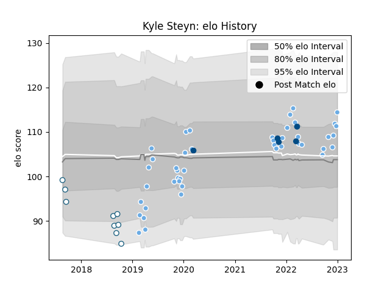

---  
layout: page  
title: Kyle Steyn  
date: 2023-02-02 19:06:39.460520  
categories: player  
---
# Kyle Steyn

## Positions: W, C

## Country: Scotland

## Current elo: 109.0

## Current Percentile: 81.0

# Elo History

# Match History

| Team             |   Appearances |   Win Rate |
|:-----------------|--------------:|-----------:|
| Glasgow Warriors |            46 |   0.652174 |
| Griquas          |             9 |   0.111111 |
| Scotland         |             5 |   0.8      |

| Opponent            |   Matches |   Win Rate |
|:--------------------|----------:|-----------:|
| Leinster            |         6 |   0.166667 |
| Zebre               |         5 |   1        |
| Benetton Treviso    |         5 |   0.6      |
| Edinburgh           |         4 |   1        |
| Ulster              |         3 |   0.666667 |
| Cardiff Blues       |         3 |   0.666667 |
| Golden Lions        |         2 |   0        |
| Stormers            |         2 |   0.5      |
| Sale Sharks         |         2 |   1        |
| Pumas               |         2 |   0        |
| Natal Sharks        |         2 |   0        |
| Bath Rugby          |         2 |   0.75     |
| La Rochelle         |         2 |   0.5      |
| Connacht            |         2 |   1        |
| Exeter Chiefs       |         2 |   0.25     |
| Dragons             |         2 |   0.5      |
| Scarlets            |         1 |   0        |
| Western Province    |         1 |   0        |
| Blue Bulls          |         1 |   0        |
| Tonga               |         1 |   1        |
| Cheetahs            |         1 |   1        |
| Sharks              |         1 |   1        |
| Ireland             |         1 |   0        |
| Saracens            |         1 |   0        |
| Italy               |         1 |   1        |
| Ospreys             |         1 |   1        |
| Lions               |         1 |   1        |
| France              |         1 |   1        |
| Free State Cheetahs |         1 |   1        |
| Australia           |         1 |   1        |