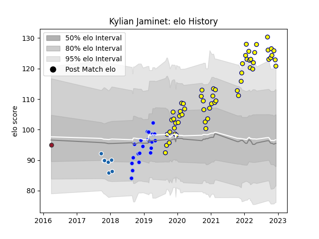

---  
layout: page  
title: Kylian Jaminet  
date: 2023-01-13 11:32:08.669588  
categories: player  
---
# Kylian Jaminet

## Positions: FB, W

## Current elo: 120.0

## Current Percentile: 87.0

# Elo History

# Match History

| Team              |   Appearances |   Win Rate |
|:------------------|--------------:|-----------:|
| Nevers            |            65 |   0.576923 |
| Colomiers         |            22 |   0.5      |
| Castres Olympique |             7 |   0.428571 |
| Toulon            |             1 |   1        |

| Opponent                   |   Matches |   Win Rate |
|:---------------------------|----------:|-----------:|
| Soyaux-Angouleme           |         7 |   0.642857 |
| Provence Rugby             |         7 |   0.714286 |
| Mont-de-Marsan             |         6 |   0.666667 |
| Carcassonne                |         6 |   0.5      |
| Colomiers                  |         6 |   0        |
| Vannes                     |         5 |   0.5      |
| Beziers                    |         5 |   0.8      |
| Biarritz Olympique         |         5 |   0.9      |
| Grenoble                   |         5 |   0.2      |
| Aurillac                   |         5 |   0.4      |
| Rouen                      |         4 |   1        |
| Oyonnax                    |         4 |   0        |
| Montauban                  |         4 |   0.75     |
| Racing 92                  |         3 |   0.666667 |
| US Bressane                |         3 |   0.666667 |
| Massy                      |         2 |   1        |
| Narbonne                   |         2 |   1        |
| Nevers                     |         2 |   0        |
| Perpignan                  |         2 |   0.5      |
| Leicester Tigers           |         2 |   0.5      |
| Brive                      |         2 |   0.5      |
| Bayonne                    |         2 |   0        |
| Agen                       |         2 |   1        |
| Munster                    |         1 |   0        |
| Lyon                       |         1 |   0        |
| Roval Drome XV             |         1 |   1        |
| Valence Romans Drome Rugby |         1 |   1        |