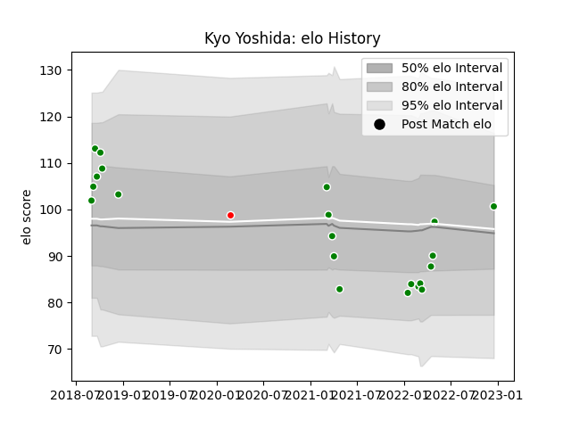

---  
layout: page  
title: Kyo Yoshida  
date: 2023-03-17 17:34:52.168319  
categories: player  
---
# Kyo Yoshida

## Positions: N8, FL

## Current elo: 101.0

## Current Percentile: 53.0

# Elo History

# Match History

| Team            |   Appearances |   Win Rate |
|:----------------|--------------:|-----------:|
| Toyota Verblitz |            21 |   0.690476 |
| Sunwolves       |             1 |   0        |

| Opponent                          |   Matches |   Win Rate |
|:----------------------------------|----------:|-----------:|
| Shizuoka Blue Revs                |         3 |   0.666667 |
| Tokyo Sungoliath                  |         3 |   0        |
| Hino Red Dolphins                 |         2 |   1        |
| Munakata Sanix Blues              |         2 |   1        |
| Urayasu D-Rocks                   |         2 |   1        |
| Black Rams Tokyo                  |         1 |   1        |
| Green Rockets Tokatsu             |         1 |   1        |
| Kobelco Kobe Steelers             |         1 |   0.5      |
| Kubota Spears Funabashi Tokyo-Bay |         1 |   0        |
| Mie Honda Heat                    |         1 |   1        |
| Mitsubishi Dynaboars              |         1 |   1        |
| NTT Docomo Red Hurricanes Osaka   |         1 |   1        |
| Queensland Reds                   |         1 |   0        |
| Saitama Wild Knights              |         1 |   0        |
| Toshiba Brave Lupus Tokyo         |         1 |   1        |