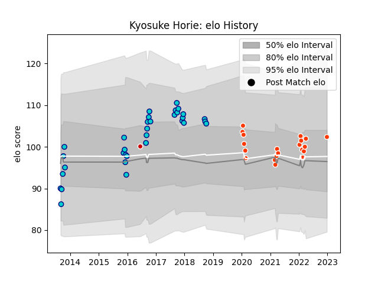

---  
layout: page  
title: Kyosuke Horie  
date: 2023-01-15 11:51:39.401119  
categories: player  
---
# Kyosuke Horie

## Positions: N8, FL

## Country: Japan

## Current elo: 103.0

## Current Percentile: 58.0

# Elo History

# Match History

| Team               |   Appearances |   Win Rate |
|:-------------------|--------------:|-----------:|
| Shizuoka Blue Revs |            33 |   0.80303  |
| Hino Red Dolphins  |            21 |   0.190476 |
| Japan              |             1 |   1        |

| Opponent                          |   Matches |   Win Rate |
|:----------------------------------|----------:|-----------:|
| Saitama Wild Knights              |         5 |   0.3      |
| Black Rams Tokyo                  |         4 |   0.75     |
| Mie Honda Heat                    |         4 |   0.25     |
| Toshiba Brave Lupus Tokyo         |         4 |   0.75     |
| Yokohama Canon Eagles             |         4 |   0.75     |
| Kobelco Kobe Steelers             |         3 |   0        |
| Kubota Spears Funabashi Tokyo-Bay |         3 |   0.666667 |
| Hanazono Kintetsu Liners          |         3 |   0.333333 |
| Green Rockets Tokatsu             |         3 |   1        |
| Coca-Cola Red Sparks              |         3 |   1        |
| Toyota Industries Shuttles Aichi  |         3 |   0.666667 |
| Urayasu D-Rocks                   |         3 |   0.666667 |
| Mitsubishi Dynaboars              |         2 |   0        |
| NTT Docomo Red Hurricanes Osaka   |         2 |   0.5      |
| Toyota Verblitz                   |         2 |   0.5      |
| Munakata Sanix Blues              |         2 |   1        |
| Kamaishi Seawaves                 |         1 |   1        |
| Canada                            |         1 |   1        |
| Shizuoka Blue Revs                |         1 |   0        |
| Skyactivs Hiroshima               |         1 |   1        |
| Tokyo Sungoliath                  |         1 |   0        |