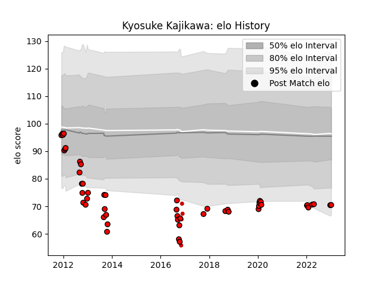

---  
layout: page  
title: Kyosuke Kajikawa  
date: 2023-02-02 18:52:31.870447  
categories: player  
---
# Kyosuke Kajikawa

## Positions: L

## Country: Japan

## Current elo: 71.0

## Current Percentile: 5.0

# Elo History

# Match History

| Team                      |   Appearances |   Win Rate |
|:--------------------------|--------------:|-----------:|
| Toshiba Brave Lupus Tokyo |            52 |   0.692308 |
| Japan                     |             4 |   0.25     |

| Opponent                          |   Matches |   Win Rate |
|:----------------------------------|----------:|-----------:|
| Shizuoka Blue Revs                |         7 |   0.571429 |
| Black Rams Tokyo                  |         5 |   0.6      |
| Yokohama Canon Eagles             |         4 |   0.75     |
| Mie Honda Heat                    |         4 |   0.75     |
| Saitama Wild Knights              |         4 |   0.5      |
| NTT Docomo Red Hurricanes Osaka   |         3 |   1        |
| Munakata Sanix Blues              |         3 |   0.666667 |
| Hanazono Kintetsu Liners          |         3 |   1        |
| Kobelco Kobe Steelers             |         3 |   0.333333 |
| Toyota Verblitz                   |         3 |   0.333333 |
| Kubota Spears Funabashi Tokyo-Bay |         2 |   1        |
| Green Rockets Tokatsu             |         2 |   1        |
| Urayasu D-Rocks                   |         2 |   1        |
| Coca-Cola Red Sparks              |         2 |   1        |
| Tokyo Sungoliath                  |         2 |   0.5      |
| Toyota Industries Shuttles Aichi  |         1 |   0        |
| Wales                             |         1 |   0        |
| Argentina                         |         1 |   0        |
| Kyuden Voltex                     |         1 |   1        |
| Georgia                           |         1 |   1        |
| Fiji                              |         1 |   0        |
| Mitsubishi Dynaboars              |         1 |   1        |