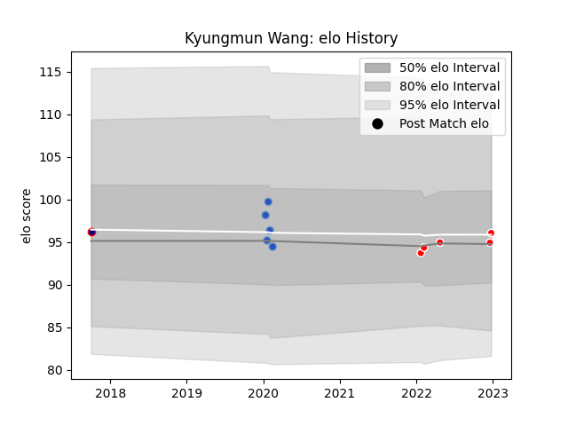

---  
layout: page  
title: Kyungmun Wang  
date: 2022-12-28 12:55:46.760049  
categories: player  
---
# Kyungmun Wang

## Positions: H

## Current elo: 96.0

## Current Percentile: None

# Elo History

# Match History

| Team                     |   Appearances |   Win Rate |
|:-------------------------|--------------:|-----------:|
| Kobelco Kobe Steelers    |             5 |        0.6 |
| Munakata Sanix Blues     |             5 |        0.4 |
| Hanazono Kintetsu Liners |             1 |        1   |

| Opponent                          |   Matches |   Win Rate |
|:----------------------------------|----------:|-----------:|
| Kubota Spears Funabashi Tokyo-Bay |         3 |   0.333333 |
| Green Rockets Tokatsu             |         2 |   1        |
| Black Rams Tokyo                  |         1 |   0        |
| Hanazono Kintetsu Liners          |         1 |   1        |
| Munakata Sanix Blues              |         1 |   1        |
| NTT Docomo Red Hurricanes Osaka   |         1 |   1        |
| Urayasu D-Rocks                   |         1 |   0        |
| Yokohama Canon Eagles             |         1 |   0        |