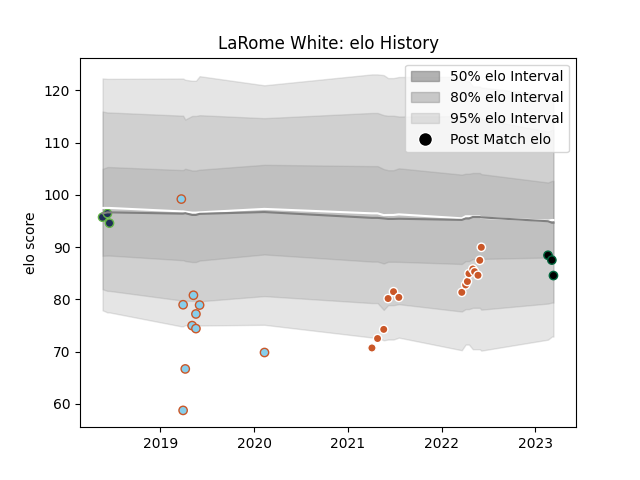

---  
layout: page  
title: LaRome White  
date: 2023-03-09 10:07:43.820751  
categories: player  
---
# LaRome White

## Positions: P

## Current elo: 88.0

## Current Percentile: None

# Elo History

# Match History

| Team               |   Appearances |   Win Rate |
|:-------------------|--------------:|-----------:|
| Austin Gilgronis   |            15 |   0.666667 |
| Austin Elite Rugby |             9 |   0        |
| Seattle Seawolves  |             3 |   0.666667 |
| Chicago Hounds     |             2 |   0        |
| Austin Herd        |             1 |   0        |

| Opponent               |   Matches |   Win Rate |
|:-----------------------|----------:|-----------:|
| Houston SaberCats      |         4 |   1        |
| San Diego Legion       |         4 |   0.75     |
| Seattle Seawolves      |         3 |   0.666667 |
| Utah Warriors          |         3 |   0.333333 |
| L. A. Giltinis         |         2 |   0        |
| NOLA Gold              |         2 |   0        |
| Old Glory DC           |         2 |   0        |
| R.U. New York          |         2 |   0        |
| Rugby New York         |         2 |   0        |
| Toronto Arrows         |         2 |   0        |
| Austin Elite Rugby     |         1 |   1        |
| Dallas Jackals         |         1 |   1        |
| Glendale Raptors       |         1 |   0        |
| New England Free Jacks |         1 |   0        |