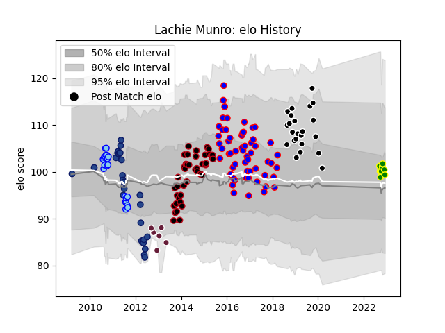

---  
layout: page  
title: Lachie Munro  
date: 2023-01-30 17:51:43.323215  
categories: player  
---
# Lachie Munro

## Positions: FH, FB

## Current elo: 112.0

## Current Percentile: 80.0

# Elo History

# Match History

| Team                |   Appearances |   Win Rate |
|:--------------------|--------------:|-----------:|
| Beziers             |            78 |   0.544872 |
| Lyon                |            45 |   0.633333 |
| Provence Rugby      |            38 |   0.447368 |
| Blues               |            27 |   0.518519 |
| Northland           |            21 |   0.428571 |
| Carqueiranne-Hyères |            11 |   0.363636 |
| Bordeaux Begles     |            10 |   0.1      |

| Opponent                   |   Matches |   Win Rate |
|:---------------------------|----------:|-----------:|
| Colomiers                  |        11 |   0.727273 |
| Carcassonne                |        10 |   0.7      |
| Aurillac                   |        10 |   0.6      |
| Mont-de-Marsan             |        10 |   0.6      |
| Biarritz Olympique         |        10 |   0.2      |
| Oyonnax                    |         8 |   0.375    |
| Dax                        |         8 |   0.625    |
| Narbonne                   |         7 |   0.571429 |
| Vannes                     |         7 |   0.428571 |
| Bourgoin-Jallieu           |         7 |   0.714286 |
| Montauban                  |         6 |   0.5      |
| Albi                       |         6 |   0.75     |
| Soyaux-Angouleme           |         6 |   0.166667 |
| Tarbes                     |         5 |   0.6      |
| Bayonne                    |         5 |   0.4      |
| US Bressane                |         4 |   0.75     |
| Massy                      |         4 |   0.75     |
| Beziers                    |         4 |   0.5      |
| Perpignan                  |         4 |   0.5      |
| Nevers                     |         4 |   0.5      |
| Hurricanes                 |         4 |   0.5      |
| Grenoble                   |         4 |   0.25     |
| Queensland Reds            |         3 |   0.333333 |
| Montpellier Herault        |         3 |   0.333333 |
| Highlanders                |         3 |   0.666667 |
| Agen                       |         3 |   0.666667 |
| Bordeaux Begles            |         3 |   0        |
| Crusaders                  |         3 |   0.333333 |
| Toulon                     |         3 |   0.333333 |
| Chiefs                     |         3 |   0.333333 |
| Racing 92                  |         2 |   0        |
| Tasman                     |         2 |   0.5      |
| Pau                        |         2 |   1        |
| Stade Francais Paris       |         2 |   0        |
| Otago                      |         2 |   1        |
| North Harbour              |         2 |   0        |
| Stade Toulousain           |         2 |   0        |
| New South Wales Waratahs   |         2 |   1        |
| Stormers                   |         2 |   0        |
| Valence Romans Drome Rugby |         2 |   0        |
| Taranaki                   |         2 |   0.5      |
| Provence Rugby             |         2 |   1        |
| Manawatu                   |         2 |   0.5      |
| Melbourne Rebels           |         2 |   0.5      |
| Lyon                       |         2 |   0        |
| Auch                       |         2 |   1        |
| La Rochelle                |         2 |   0.75     |
| Hawke's Bay                |         2 |   0.5      |
| Bay of Plenty              |         2 |   1        |
| Brive                      |         2 |   0.5      |
| Counties Manukau           |         2 |   0        |
| Cheetahs                   |         1 |   1        |
| Wellington                 |         1 |   0        |
| Waikato                    |         1 |   0        |
| Auckland                   |         1 |   0        |
| Bulls                      |         1 |   1        |
| Canterbury                 |         1 |   0        |
| Chambery                   |         1 |   1        |
| Suresnes                   |         1 |   0        |
| Cognac Saint Jean d'Angély |         1 |   1        |
| Clermont Auvergne          |         1 |   0        |
| Nice                       |         1 |   0        |
| Southland                  |         1 |   1        |
| Sharks                     |         1 |   0        |
| Roval Drome XV             |         1 |   1        |
| Edinburgh                  |         1 |   1        |
| Gloucester Rugby           |         1 |   0        |
| Lions                      |         1 |   1        |
| London Irish               |         1 |   0        |
| London Welsh               |         1 |   1        |
| Western Force              |         1 |   1        |