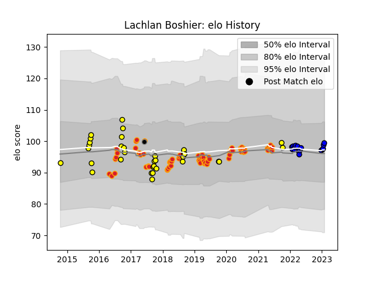

---  
layout: page  
title: Lachlan Boshier  
date: 2022-12-31 16:26:53.590205  
categories: player  
---
# Lachlan Boshier

## Positions: FL

## Current elo: 100.0

## Current Percentile: 68.0

# Elo History

# Match History

| Team                 |   Appearances |   Win Rate |
|:---------------------|--------------:|-----------:|
| Chiefs               |            62 |   0.564516 |
| Taranaki             |            33 |   0.621212 |
| Saitama Wild Knights |            12 |   1        |
| Provincial Union XV  |             1 |   0        |

| Opponent                          |   Matches |   Win Rate |
|:----------------------------------|----------:|-----------:|
| Crusaders                         |        10 |   0.4      |
| Hurricanes                        |        10 |   0.4      |
| Blues                             |         8 |   0.6875   |
| Highlanders                       |         7 |   0.357143 |
| Canterbury                        |         5 |   0.4      |
| Bay of Plenty                     |         4 |   0.75     |
| Queensland Reds                   |         4 |   0.75     |
| Manawatu                          |         4 |   1        |
| Waikato                           |         4 |   0.375    |
| Counties Manukau                  |         4 |   1        |
| Tasman                            |         4 |   0.25     |
| Sunwolves                         |         3 |   0.666667 |
| Stormers                          |         3 |   0.666667 |
| Auckland                          |         3 |   0.666667 |
| New South Wales Waratahs          |         3 |   0.666667 |
| Brumbies                          |         3 |   0.666667 |
| Shizuoka Blue Revs                |         2 |   1        |
| Western Force                     |         2 |   1        |
| Urayasu D-Rocks                   |         2 |   1        |
| Yokohama Canon Eagles             |         2 |   1        |
| Melbourne Rebels                  |         2 |   1        |
| Kobelco Kobe Steelers             |         2 |   1        |
| Jaguares                          |         2 |   0.5      |
| Bulls                             |         2 |   1        |
| British and Irish Lions           |         2 |   0        |
| Northland                         |         1 |   0        |
| Otago                             |         1 |   1        |
| Sharks                            |         1 |   1        |
| Lions                             |         1 |   0        |
| Southland                         |         1 |   1        |
| Kubota Spears Funabashi Tokyo-Bay |         1 |   1        |
| Tokyo Sungoliath                  |         1 |   1        |
| Toshiba Brave Lupus Tokyo         |         1 |   1        |
| Hawke's Bay                       |         1 |   1        |
| Wellington                        |         1 |   0        |
| NTT Docomo Red Hurricanes Osaka   |         1 |   1        |