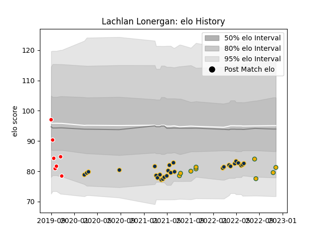

---  
layout: page  
title: Lachlan Lonergan  
date: 2022-11-15 23:43:27.921534  
categories: player  
---
# Lachlan Lonergan

## Positions: H

## Country: Australia

## Current elo: 96.0

## Current Percentile: 48.0

# Elo History

# Match History

| Team      |   Appearances |   Win Rate |
|:----------|--------------:|-----------:|
| Brumbies  |            27 |   0.62963  |
| Australia |             7 |   0.428571 |

| Opponent                 |   Matches |   Win Rate |
|:-------------------------|----------:|-----------:|
| New South Wales Waratahs |         4 |   1        |
| Queensland Reds          |         4 |   0        |
| Western Force            |         4 |   1        |
| Argentina                |         3 |   0.666667 |
| Hurricanes               |         3 |   1        |
| Chiefs                   |         2 |   0.5      |
| Crusaders                |         2 |   0        |
| France                   |         2 |   0.5      |
| Highlanders              |         2 |   0.5      |
| Melbourne Rebels         |         2 |   1        |
| Blues                    |         1 |   0        |
| Fijian Drua              |         1 |   1        |
| Italy                    |         1 |   0        |
| Moana Pasifika           |         1 |   0        |
| New Zealand              |         1 |   0        |
| Sunwolves                |         1 |   1        |