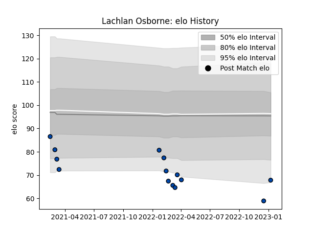

---  
layout: page  
title: Lachlan Osborne  
date: 2023-01-13 11:35:15.575444  
categories: player  
---
# Lachlan Osborne

## Positions: L

## Current elo: 68.0

## Current Percentile: 1.0

# Elo History

# Match History

| Team                |   Appearances |   Win Rate |
|:--------------------|--------------:|-----------:|
| Skyactivs Hiroshima |            14 |   0.142857 |

| Opponent                         |   Matches |   Win Rate |
|:---------------------------------|----------:|-----------:|
| Chugoku Red Regulions            |         2 |        0.5 |
| Hanazono Kintetsu Liners         |         2 |        0   |
| Kamaishi Seawaves                |         2 |        0.5 |
| Mie Honda Heat                   |         2 |        0   |
| Mitsubishi Dynaboars             |         2 |        0   |
| Coca-Cola Red Sparks             |         1 |        0   |
| Kurita Water Gush                |         1 |        0   |
| Kyuden Voltex                    |         1 |        0   |
| Toyota Industries Shuttles Aichi |         1 |        0   |