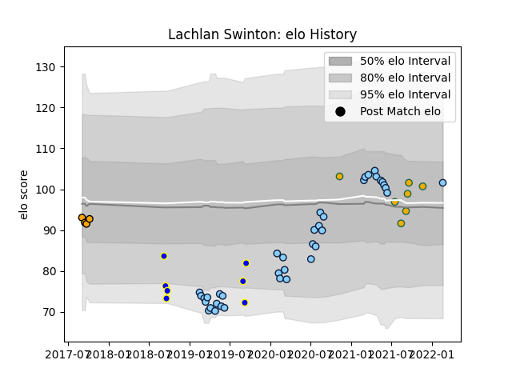

---  
layout: page  
title: Lachlan Swinton  
date: 2023-03-21 18:25:10.983908  
categories: player  
---
# Lachlan Swinton

Last updated: 2023-03-21
## Positions: FL

## Country: Australia

## Current elo: 102.0

## Current Percentile: 68.0

# Elo History

# Match History

| Team                     |   Appearances |   Win Rate |
|:-------------------------|--------------:|-----------:|
| New South Wales Waratahs |            42 |   0.285714 |
| Australia                |             7 |   0.571429 |
| Sydney Rays              |             7 |   0.142857 |
| NSW Country Eagles       |             4 |   0.25     |

| Opponent            |   Matches |   Win Rate |
|:--------------------|----------:|-----------:|
| Brumbies            |         7 |   0        |
| Melbourne Rebels    |         7 |   0.285714 |
| Western Force       |         4 |   0.5      |
| Fijian Drua         |         4 |   0.5      |
| Queensland Reds     |         4 |   0.75     |
| New Zealand         |         3 |   0.333333 |
| Hurricanes          |         3 |   0        |
| Blues               |         3 |   0        |
| Crusaders           |         3 |   0.333333 |
| Brisbane City       |         2 |   0        |
| Chiefs              |         2 |   0        |
| NSW Country Eagles  |         2 |   0        |
| Canberra Vikings    |         2 |   0.5      |
| Queensland Country  |         2 |   0.5      |
| South Africa        |         2 |   1        |
| Sunwolves           |         2 |   0.5      |
| France              |         1 |   1        |
| Greater Sydney Rams |         1 |   0        |
| Highlanders         |         1 |   0        |
| Lions               |         1 |   1        |
| Bulls               |         1 |   0        |
| Sharks              |         1 |   0        |
| Wales               |         1 |   0        |
| Jaguares            |         1 |   0        |