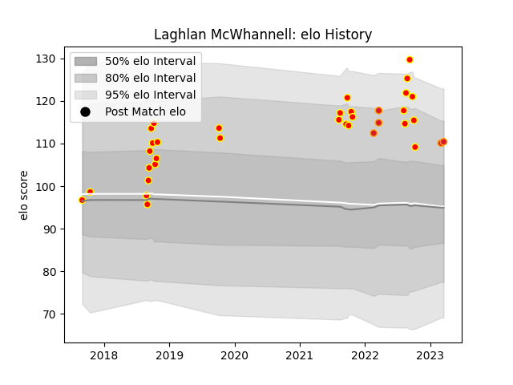

---  
layout: page  
title: Laghlan McWhannell  
date: 2023-03-04 11:39:18.225068  
categories: player  
---
# Laghlan McWhannell

## Positions: L

## Current elo: 109.0

## Current Percentile: 87.0

# Elo History

# Match History

| Team    |   Appearances |   Win Rate |
|:--------|--------------:|-----------:|
| Waikato |            30 |   0.616667 |
| Chiefs  |             3 |   1        |

| Opponent         |   Matches |   Win Rate |
|:-----------------|----------:|-----------:|
| Bay of Plenty    |         4 |   0.5      |
| Northland        |         4 |   0.75     |
| Wellington       |         4 |   0.5      |
| Auckland         |         3 |   0.666667 |
| Hawke's Bay      |         3 |   0.5      |
| Taranaki         |         3 |   0.666667 |
| Moana Pasifika   |         2 |   1        |
| North Harbour    |         2 |   0.5      |
| Otago            |         2 |   0.5      |
| Canterbury       |         1 |   0        |
| Counties Manukau |         1 |   1        |
| Highlanders      |         1 |   1        |
| Manawatu         |         1 |   1        |
| Southland        |         1 |   1        |
| Tasman           |         1 |   1        |