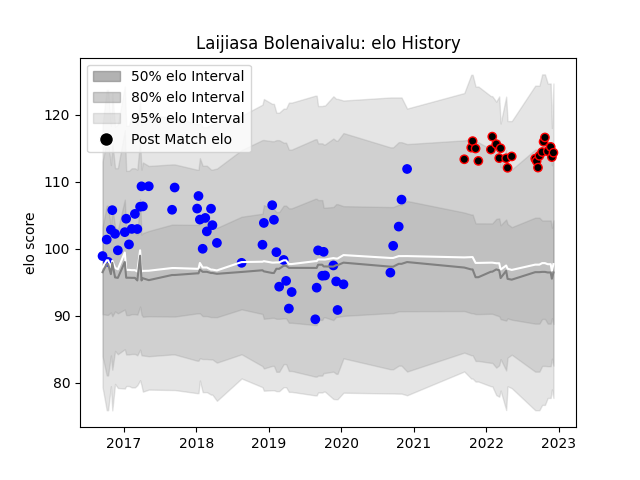

---  
layout: page  
title: Laijiasa Bolenaivalu  
date: 2022-12-14 11:14:41.699545  
categories: player  
---
# Laijiasa Bolenaivalu

## Positions: N8, FL

## Current elo: 113.0

## Current Percentile: 89.0

# Elo History

# Match History

| Team   |   Appearances |   Win Rate |
|:-------|--------------:|-----------:|
| Vannes |            54 |   0.555556 |
| Nice   |            25 |   0.58     |

| Opponent                   |   Matches |   Win Rate |
|:---------------------------|----------:|-----------:|
| Soyaux-Angouleme           |         6 |   0.833333 |
| Aurillac                   |         6 |   0.833333 |
| Dax                        |         5 |   0.2      |
| Albi                       |         4 |   0.875    |
| Biarritz Olympique         |         4 |   0.5      |
| Bourgoin-Jallieu           |         4 |   0.375    |
| Carcassonne                |         4 |   0        |
| Colomiers                  |         3 |   0.666667 |
| Nevers                     |         3 |   0.666667 |
| Narbonne                   |         3 |   0.333333 |
| Massy                      |         3 |   0.666667 |
| Bayonne                    |         3 |   0.666667 |
| Cognac Saint Jean d'Angély |         2 |   1        |
| Blagnac                    |         2 |   0.5      |
| Tarbes                     |         2 |   1        |
| Suresnes                   |         2 |   1        |
| Rouen                      |         2 |   0.5      |
| Perpignan                  |         2 |   0        |
| Beziers                    |         2 |   0.5      |
| Oyonnax                    |         2 |   1        |
| Mont-de-Marsan             |         2 |   1        |
| Dijon                      |         2 |   0.5      |
| Valence Romans Drome Rugby |         2 |   0        |
| Montauban                  |         1 |   0        |
| Chambery                   |         1 |   0        |
| Provence Rugby             |         1 |   0        |
| Rennes                     |         1 |   1        |
| Brive                      |         1 |   0        |
| Roval Drome XV             |         1 |   1        |
| Grenoble                   |         1 |   0        |
| Carqueiranne-Hyères        |         1 |   1        |
| US Bressane                |         1 |   0.5      |