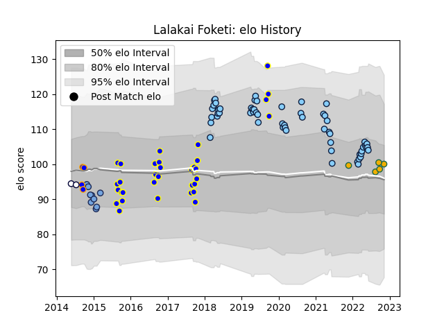

---  
layout: page  
title: Lalakai Foketi  
date: 2023-03-21 18:56:33.361844  
categories: player  
---
# Lalakai Foketi

Last updated: 2023-03-21
## Positions: C

## Country: Australia

## Current elo: 101.0

## Current Percentile: 64.0

# Elo History

# Match History

| Team                     |   Appearances |   Win Rate |
|:-------------------------|--------------:|-----------:|
| New South Wales Waratahs |            61 |  0.368852  |
| Bay of Plenty            |            30 |  0.383333  |
| Bayonne                  |             9 |  0.0555556 |
| Australia                |             5 |  0         |
| Greater Sydney Rams      |             4 |  0.625     |
| Sydney Rays              |             4 |  0.25      |
| Melbourne Rebels         |             2 |  0         |

| Opponent                 |   Matches |   Win Rate |
|:-------------------------|----------:|-----------:|
| Melbourne Rebels         |         8 |   0.5      |
| Brumbies                 |         7 |   0.142857 |
| Queensland Reds          |         7 |   0.571429 |
| Blues                    |         5 |   0        |
| Otago                    |         5 |   0.4      |
| Western Force            |         4 |   0.75     |
| Highlanders              |         4 |   0.5      |
| Hawke's Bay              |         4 |   0.5      |
| Fijian Drua              |         4 |   0.75     |
| Crusaders                |         4 |   0.25     |
| Chiefs                   |         4 |   0        |
| Wellington               |         3 |   0        |
| Hurricanes               |         3 |   0        |
| Taranaki                 |         3 |   0        |
| Lions                    |         3 |   0.333333 |
| Northland                |         2 |   0.5      |
| Sunwolves                |         2 |   0.5      |
| Queensland Country       |         2 |   0.5      |
| North Harbour            |         2 |   0.5      |
| New Zealand              |         2 |   0        |
| Auckland                 |         2 |   0        |
| Jaguares                 |         2 |   0        |
| Manawatu                 |         2 |   1        |
| La Rochelle              |         2 |   0.25     |
| Sharks                   |         2 |   0.25     |
| Waikato                  |         2 |   0.5      |
| Counties Manukau         |         2 |   0.25     |
| Connacht                 |         2 |   0        |
| Bulls                    |         2 |   0        |
| Southland                |         2 |   1        |
| Tasman                   |         1 |   0        |
| Sydney Stars             |         1 |   1        |
| Toulon                   |         1 |   0        |
| Stormers                 |         1 |   1        |
| Wales                    |         1 |   0        |
| Argentina                |         1 |   0        |
| Racing 92                |         1 |   0        |
| Perth Spirit             |         1 |   1        |
| North Harbour Rays       |         1 |   0.5      |
| New South Wales Waratahs |         1 |   0        |
| NSW Country Eagles       |         1 |   0        |
| Melbourne Rising         |         1 |   0        |
| France                   |         1 |   0        |
| Exeter Chiefs            |         1 |   0        |
| Clermont Auvergne        |         1 |   0        |
| Brive                    |         1 |   0        |
| Moana Pasifika           |         1 |   1        |