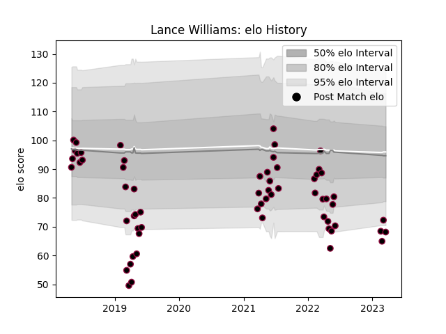

---  
layout: page  
title: Lance Williams  
date: 2023-03-02 11:21:18.071607  
categories: player  
---
# Lance Williams

## Positions: FL, N8

## Current elo: 65.0

## Current Percentile: 4.0

# Elo History

# Match History

| Team          |   Appearances |   Win Rate |
|:--------------|--------------:|-----------:|
| Utah Warriors |            60 |       0.35 |

| Opponent               |   Matches |   Win Rate |
|:-----------------------|----------:|-----------:|
| Houston SaberCats      |         7 |   0.428571 |
| San Diego Legion       |         7 |   0        |
| Seattle Seawolves      |         7 |   0.214286 |
| Austin Elite Rugby     |         4 |   0.75     |
| Glendale Raptors       |         4 |   0.125    |
| L. A. Giltinis         |         4 |   0.5      |
| NOLA Gold              |         4 |   0        |
| Toronto Arrows         |         4 |   0.25     |
| Austin Gilgronis       |         3 |   0.666667 |
| Dallas Jackals         |         3 |   1        |
| R.U. New York          |         3 |   0.333333 |
| Rugby New York         |         3 |   0.333333 |
| New England Free Jacks |         2 |   0        |
| Old Glory DC           |         2 |   0.5      |
| Rugby ATL              |         2 |   0.5      |
| Austin Herd            |         1 |   1        |