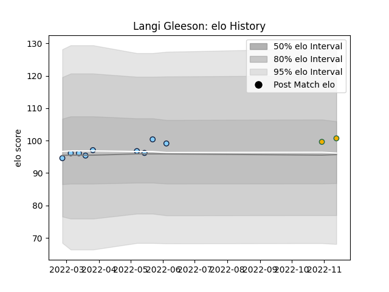

---  
layout: page  
title: Langi Gleeson  
date: 2023-03-21 18:28:29.670493  
categories: player  
---
# Langi Gleeson

Last updated: 2023-03-21
## Positions: N8, FL

## Country: Australia

## Current elo: 105.0

## Current Percentile: 71.0

# Elo History

# Match History

| Team                     |   Appearances |   Win Rate |
|:-------------------------|--------------:|-----------:|
| New South Wales Waratahs |            13 |   0.384615 |
| Australia                |             3 |   0.666667 |

| Opponent         |   Matches |   Win Rate |
|:-----------------|----------:|-----------:|
| Brumbies         |         2 |        0   |
| Hurricanes       |         2 |        0   |
| Melbourne Rebels |         2 |        0.5 |
| Queensland Reds  |         2 |        0   |
| Chiefs           |         1 |        0   |
| Fijian Drua      |         1 |        1   |
| Highlanders      |         1 |        1   |
| Italy            |         1 |        0   |
| Moana Pasifika   |         1 |        1   |
| Scotland         |         1 |        1   |
| Wales            |         1 |        1   |
| Western Force    |         1 |        1   |