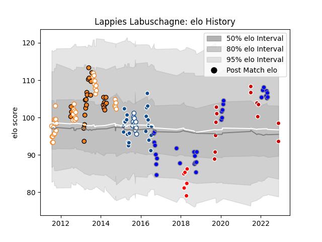

---  
layout: page  
title: Lappies Labuschagne  
date: 2022-11-22 11:36:54.190210  
categories: player  
---
# Lappies Labuschagne

## Positions: FL

## Country: Japan

## Current elo: 99.0

## Current Percentile: 80.0

# Elo History

# Match History

| Team                              |   Appearances |   Win Rate |
|:----------------------------------|--------------:|-----------:|
| Free State Cheetahs               |            38 |   0.486842 |
| Kubota Spears Funabashi Tokyo-Bay |            31 |   0.629032 |
| Cheetahs                          |            27 |   0.425926 |
| Bulls                             |            23 |   0.521739 |
| Japan                             |            13 |   0.307692 |
| Blue Bulls                        |            11 |   0.727273 |
| Sunwolves                         |             7 |   0        |

| Opponent                         |   Matches |   Win Rate |
|:---------------------------------|----------:|-----------:|
| Western Province                 |         9 |   0.333333 |
| Golden Lions                     |         8 |   0.3125   |
| Griquas                          |         8 |   0.875    |
| Natal Sharks                     |         8 |   0.3125   |
| Blue Bulls                       |         7 |   0.357143 |
| Stormers                         |         6 |   0.333333 |
| Sharks                           |         5 |   0.6      |
| Melbourne Rebels                 |         4 |   0.25     |
| Lions                            |         4 |   0.25     |
| Brumbies                         |         4 |   0        |
| Blues                            |         4 |   0.25     |
| Bulls                            |         4 |   0.25     |
| Toyota Verblitz                  |         3 |   0.333333 |
| Chiefs                           |         3 |   0.166667 |
| Pumas                            |         3 |   1        |
| Mie Honda Heat                   |         3 |   1        |
| Cheetahs                         |         3 |   1        |
| Queensland Reds                  |         3 |   0.666667 |
| Saitama Wild Knights             |         3 |   0        |
| Ireland                          |         3 |   0.333333 |
| Hurricanes                       |         3 |   0        |
| Western Force                    |         3 |   1        |
| Green Rockets Tokatsu            |         3 |   0.5      |
| New South Wales Waratahs         |         3 |   0.333333 |
| Southern Kings                   |         3 |   1        |
| Urayasu D-Rocks                  |         3 |   1        |
| Yokohama Canon Eagles            |         3 |   0.666667 |
| Toshiba Brave Lupus Tokyo        |         2 |   0.5      |
| Shizuoka Blue Revs               |         2 |   0        |
| Scotland                         |         2 |   0.5      |
| South Africa                     |         2 |   0        |
| Leopards                         |         2 |   1        |
| Munakata Sanix Blues             |         2 |   1        |
| Eastern Province Kings           |         2 |   1        |
| Coca-Cola Red Sparks             |         2 |   1        |
| Crusaders                        |         2 |   0        |
| Free State Cheetahs              |         2 |   1        |
| Jaguares                         |         1 |   0        |
| Hino Red Dolphins                |         1 |   1        |
| Highlanders                      |         1 |   1        |
| Hanazono Kintetsu Liners         |         1 |   0        |
| Black Rams Tokyo                 |         1 |   1        |
| France                           |         1 |   0        |
| Sunwolves                        |         1 |   1        |
| England                          |         1 |   0        |
| Toyota Industries Shuttles Aichi |         1 |   1        |
| Samoa                            |         1 |   1        |
| Kobelco Kobe Steelers            |         1 |   1        |
| Russia                           |         1 |   1        |
| British and Irish Lions          |         1 |   0        |
| Australia                        |         1 |   0        |