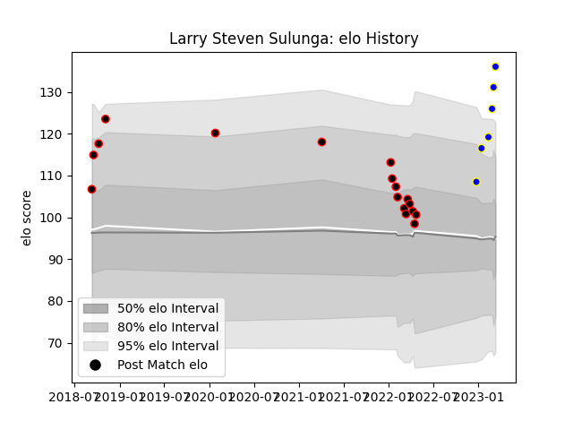

---  
layout: page  
title: Larry Steven Sulunga  
date: 2022-12-28 12:53:44.883971  
categories: player  
---
# Larry Steven Sulunga

## Positions: W, FB

## Current elo: 90.0

## Current Percentile: 16.0

# Elo History

# Match History

| Team                            |   Appearances |   Win Rate |
|:--------------------------------|--------------:|-----------:|
| NTT Docomo Red Hurricanes Osaka |            17 |   0.235294 |
| Urayasu D-Rocks                 |             1 |   1        |

| Opponent                          |   Matches |   Win Rate |
|:----------------------------------|----------:|-----------:|
| Shizuoka Blue Revs                |         2 |          0 |
| Tokyo Sungoliath                  |         2 |          0 |
| Toshiba Brave Lupus Tokyo         |         2 |          0 |
| Black Rams Tokyo                  |         1 |          0 |
| Green Rockets Tokatsu             |         1 |          1 |
| Hanazono Kintetsu Liners          |         1 |          0 |
| Kamaishi Seawaves                 |         1 |          1 |
| Kubota Spears Funabashi Tokyo-Bay |         1 |          0 |
| Kurita Water Gush                 |         1 |          1 |
| Mitsubishi Dynaboars              |         1 |          1 |
| Munakata Sanix Blues              |         1 |          0 |
| Saitama Wild Knights              |         1 |          0 |
| Shimizu Blue Sharks               |         1 |          1 |
| Toyota Verblitz                   |         1 |          0 |
| Yokohama Canon Eagles             |         1 |          0 |