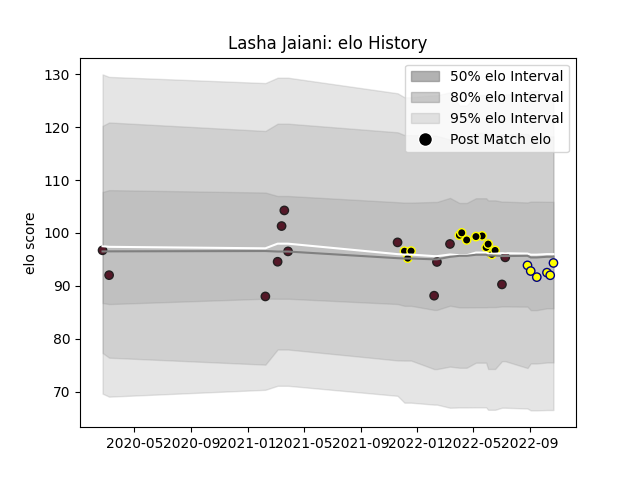

---  
layout: page  
title: Lasha Jaiani  
date: 2023-03-21 18:19:23.817838  
categories: player  
---
# Lasha Jaiani

Last updated: 2023-03-21
## Positions: L

## Country: Georgia

## Current elo: 94.0

## Current Percentile: 40.0

# Elo History

# Match History

| Team       |   Appearances |   Win Rate |
|:-----------|--------------:|-----------:|
| Georgia    |            13 |   0.846154 |
| Black Lion |            12 |   0.75     |
| Nevers     |             6 |   0.583333 |

| Opponent                 |   Matches |   Win Rate |
|:-------------------------|----------:|-----------:|
| Portugal                 |         3 |   0.833333 |
| Russia                   |         2 |   1        |
| Romania                  |         2 |   1        |
| Argentina                |         1 |   0        |
| Lusitanos XV             |         1 |   1        |
| Tel-Aviv Heat            |         1 |   1        |
| Spain                    |         1 |   1        |
| Soyaux-Angouleme         |         1 |   1        |
| SWD Eagles               |         1 |   1        |
| Rouen                    |         1 |   1        |
| Provence Rugby           |         1 |   1        |
| Netherlands              |         1 |   1        |
| Montauban                |         1 |   0        |
| Lokomotiv Penza          |         1 |   0        |
| Belgium                  |         1 |   1        |
| Leopards                 |         1 |   1        |
| Italy                    |         1 |   1        |
| Griffons                 |         1 |   0        |
| Fiji                     |         1 |   0.5      |
| Enisey-STM Krasnoyarsk   |         1 |   1        |
| Eastern Province Kings   |         1 |   1        |
| Colomiers                |         1 |   0        |
| Castilla y Leon Iberians |         1 |   1        |
| Border Bulldogs          |         1 |   1        |
| Boland Cavaliers         |         1 |   0        |
| Biarritz Olympique       |         1 |   0.5      |
| Zimbabwe Goshawks        |         1 |   1        |