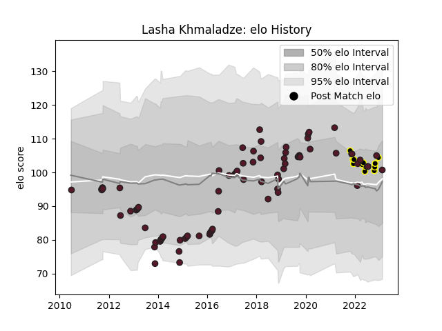

---  
layout: page  
title: Lasha Khmaladze  
date: 2022-11-22 11:28:43.104077  
categories: player  
---
# Lasha Khmaladze

## Positions: FH, FB

## Country: Georgia

## Current elo: 106.0

## Current Percentile: 76.0

# Elo History

# Match History

| Team       |   Appearances |   Win Rate |
|:-----------|--------------:|-----------:|
| Georgia    |            51 |   0.578431 |
| Black Lion |             2 |   0.5      |

| Opponent                 |   Matches |   Win Rate |
|:-------------------------|----------:|-----------:|
| Romania                  |         5 |   1        |
| Argentina                |         4 |   0        |
| Portugal                 |         4 |   0.875    |
| Japan                    |         3 |   0.333333 |
| United States of America |         3 |   0.333333 |
| Tonga                    |         3 |   0.666667 |
| Spain                    |         3 |   1        |
| Samoa                    |         3 |   0.833333 |
| Wales                    |         3 |   0.333333 |
| Italy                    |         3 |   0.333333 |
| Fiji                     |         3 |   0.5      |
| Canada                   |         3 |   1        |
| Germany                  |         2 |   1        |
| Scotland                 |         2 |   0        |
| Italy A                  |         1 |   0        |
| Australia                |         1 |   0        |
| Ireland                  |         1 |   0        |
| Russia                   |         1 |   1        |
| SWD Eagles               |         1 |   1        |
| England                  |         1 |   0        |
| Boland Cavaliers         |         1 |   0        |
| Uruguay                  |         1 |   1        |
| Netherlands              |         1 |   1        |