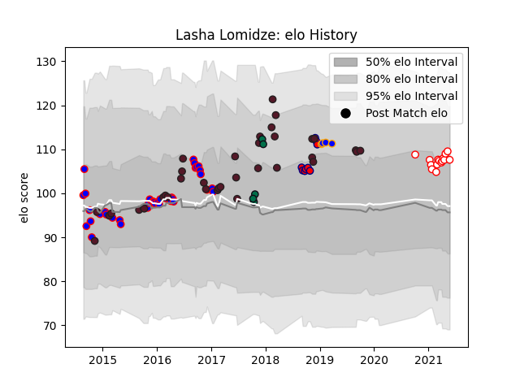

---  
layout: page  
title: Lasha Lomidze  
date: 2022-11-15 23:42:37.625065  
categories: player  
---
# Lasha Lomidze

## Positions: N8, FL

## Country: Georgia

## Current elo: 102.0

## Current Percentile: None

# Elo History

# Match History

| Team         |   Appearances |   Win Rate |
|:-------------|--------------:|-----------:|
| Georgia      |            26 |   0.557692 |
| Beziers      |            24 |   0.375    |
| Dax          |             9 |   0.444444 |
| London Irish |             5 |   0.2      |
| Aurillac     |             3 |   0        |

| Opponent                   |   Matches |   Win Rate |
|:---------------------------|----------:|-----------:|
| Narbonne                   |         4 |   0.25     |
| Perpignan                  |         3 |   0        |
| Samoa                      |         3 |   0.5      |
| Dax                        |         3 |   0.333333 |
| Scotland                   |         3 |   0        |
| Canada                     |         3 |   0.666667 |
| Carcassonne                |         2 |   0.5      |
| Albi                       |         2 |   1        |
| Japan                      |         2 |   0.5      |
| Italy                      |         2 |   0        |
| Edinburgh                  |         2 |   0        |
| Agen                       |         2 |   0.5      |
| Stade Francais Paris       |         2 |   0.5      |
| Bourgoin-Jallieu           |         2 |   0.5      |
| Tarbes                     |         2 |   0.5      |
| Bayonne                    |         2 |   0        |
| United States of America   |         2 |   1        |
| Soyaux-Angouleme           |         2 |   0        |
| Spain                      |         1 |   1        |
| Pau                        |         1 |   0        |
| Suresnes                   |         1 |   0        |
| Tonga                      |         1 |   1        |
| Russia                     |         1 |   1        |
| Romania                    |         1 |   1        |
| Uruguay                    |         1 |   1        |
| Provence Rugby             |         1 |   1        |
| Montauban                  |         1 |   0        |
| Oyonnax                    |         1 |   0        |
| New Zealand                |         1 |   0        |
| Namibia                    |         1 |   1        |
| Leicester Tigers           |         1 |   0        |
| Germany                    |         1 |   1        |
| Colomiers                  |         1 |   1        |
| Cognac Saint Jean d'Angély |         1 |   0        |
| Chambery                   |         1 |   1        |
| Brive                      |         1 |   0        |
| Blagnac                    |         1 |   0        |
| Biarritz Olympique         |         1 |   1        |
| Belgium                    |         1 |   1        |
| Aubenas                    |         1 |   1        |
| Argentina                  |         1 |   0        |
| Wales                      |         1 |   0        |