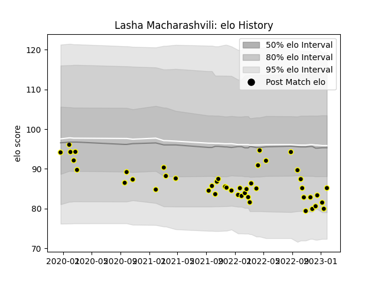

---  
layout: page  
title: Lasha Macharashvili  
date: 2023-01-13 11:32:45.320799  
categories: player  
---
# Lasha Macharashvili

## Positions: P

## Current elo: 82.0

## Current Percentile: 14.0

# Elo History

# Match History

| Team           |   Appearances |   Win Rate |
|:---------------|--------------:|-----------:|
| Mont-de-Marsan |            44 |   0.545455 |

| Opponent         |   Matches |   Win Rate |
|:-----------------|----------:|-----------:|
| Aurillac         |         5 |   1        |
| Nevers           |         4 |   0.25     |
| Agen             |         3 |   0.666667 |
| Montauban        |         3 |   0.333333 |
| Rouen            |         3 |   0.666667 |
| Oyonnax          |         3 |   0.333333 |
| Vannes           |         3 |   0        |
| Colomiers        |         3 |   0.666667 |
| Carcassonne      |         3 |   0.666667 |
| Beziers          |         3 |   0.666667 |
| Grenoble         |         2 |   0.5      |
| Provence Rugby   |         2 |   0        |
| Massy            |         1 |   0        |
| Perpignan        |         1 |   1        |
| Bayonne          |         1 |   1        |
| Roval Drome XV   |         1 |   0        |
| Soyaux-Angouleme |         1 |   1        |
| US Bressane      |         1 |   1        |
| Narbonne         |         1 |   1        |