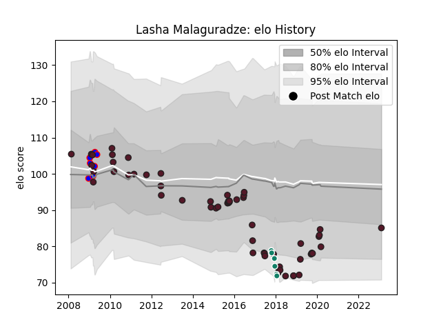

---  
layout: page  
title: Lasha Malaguradze  
date: 2023-02-05 15:10:31.739278  
categories: player  
---
# Lasha Malaguradze

## Positions: FH, C

## Country: Georgia

## Current elo: 85.0

## Current Percentile: None

# Elo History

# Match History

| Team                   |   Appearances |   Win Rate |
|:-----------------------|--------------:|-----------:|
| Georgia                |            60 |   0.65     |
| Beziers                |             7 |   0.214286 |
| Krasny Yar             |             6 |   0.166667 |
| Krasny Yar Krasnoyarsk |             6 |   0.166667 |

| Opponent                 |   Matches |   Win Rate |
|:-------------------------|----------:|-----------:|
| Romania                  |         6 |   0.833333 |
| Germany                  |         6 |   1        |
| Portugal                 |         5 |   0.9      |
| Spain                    |         5 |   1        |
| United States of America |         4 |   0.75     |
| Canada                   |         4 |   0.5      |
| Edinburgh                |         4 |   0        |
| Stade Francais Paris     |         4 |   0.5      |
| London Irish             |         4 |   0        |
| Argentina                |         4 |   0        |
| Tonga                    |         3 |   0.666667 |
| Russia                   |         3 |   1        |
| Japan                    |         3 |   0        |
| Albi                     |         2 |   0.25     |
| Samoa                    |         2 |   0.75     |
| Namibia                  |         2 |   1        |
| Scotland                 |         2 |   0        |
| Italy                    |         2 |   0        |
| Fiji                     |         2 |   0.5      |
| Belgium                  |         2 |   1        |
| Ukraine                  |         1 |   1        |
| US Bressane              |         1 |   0        |
| New Zealand              |         1 |   0        |
| Pau                      |         1 |   0        |
| Oyonnax                  |         1 |   0        |
| Narbonne                 |         1 |   0        |
| La Rochelle              |         1 |   1        |
| Ireland                  |         1 |   0        |
| Australia                |         1 |   0        |
| Uruguay                  |         1 |   1        |