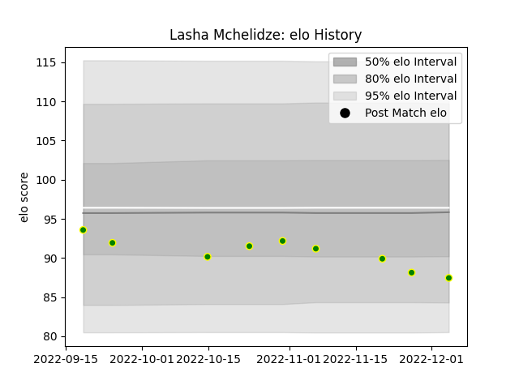

---  
layout: page  
title: Lasha Mchelidze  
date: 2023-01-17 11:40:46.870373  
categories: player  
---
# Lasha Mchelidze

## Positions: P

## Current elo: 95.0

## Current Percentile: 38.0

# Elo History

# Match History

| Team                |   Appearances |   Win Rate |
|:--------------------|--------------:|-----------:|
| Carqueiranne-Hyères |            12 |   0.333333 |

| Opponent                   |   Matches |   Win Rate |
|:---------------------------|----------:|-----------:|
| Albi                       |         1 |          1 |
| Blagnac                    |         1 |          0 |
| Bourgoin-Jallieu           |         1 |          0 |
| Chambery                   |         1 |          1 |
| Cognac Saint Jean d'Angély |         1 |          1 |
| Dax                        |         1 |          0 |
| Narbonne                   |         1 |          0 |
| Nice                       |         1 |          0 |
| Rennes                     |         1 |          0 |
| Suresnes                   |         1 |          1 |
| US Bressane                |         1 |          0 |
| Valence Romans Drome Rugby |         1 |          0 |