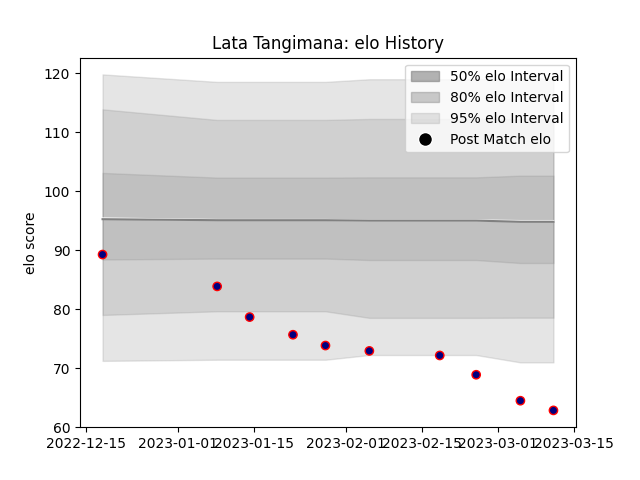

---  
layout: page  
title: Lata Tangimana  
date: 2023-03-17 17:37:04.957397  
categories: player  
---
# Lata Tangimana

## Positions: P

## Current elo: 63.0

## Current Percentile: 2.0

# Elo History

# Match History

| Team                     |   Appearances |   Win Rate |
|:-------------------------|--------------:|-----------:|
| Hanazono Kintetsu Liners |            10 |          0 |

| Opponent                          |   Matches |   Win Rate |
|:----------------------------------|----------:|-----------:|
| Black Rams Tokyo                  |         1 |          0 |
| Green Rockets Tokatsu             |         1 |          0 |
| Kubota Spears Funabashi Tokyo-Bay |         1 |          0 |
| Mitsubishi Dynaboars              |         1 |          0 |
| Saitama Wild Knights              |         1 |          0 |
| Shizuoka Blue Revs                |         1 |          0 |
| Tokyo Sungoliath                  |         1 |          0 |
| Toshiba Brave Lupus Tokyo         |         1 |          0 |
| Toyota Verblitz                   |         1 |          0 |
| Yokohama Canon Eagles             |         1 |          0 |