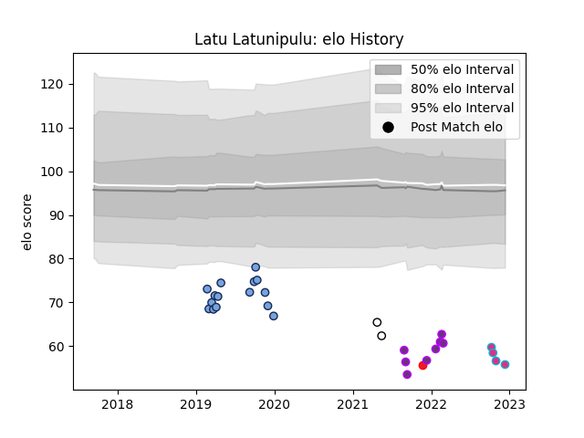

---  
layout: page  
title: Latu Latunipulu  
date: 2022-12-14 11:31:57.854391  
categories: player  
---
# Latu Latunipulu

## Positions: W, C

## Country: Tonga

## Current elo: 56.0

## Current Percentile: 0.0

# Elo History

# Match History

| Team                       |   Appearances |   Win Rate |
|:---------------------------|--------------:|-----------:|
| Bayonne                    |            15 |      0.4   |
| Sydney Rays                |             8 |      0.125 |
| US Bressane                |             8 |      0.25  |
| Zebre                      |             4 |      0     |
| Valence Romans Drome Rugby |             2 |      0     |
| Tonga                      |             1 |      0     |

| Opponent             |   Matches |   Win Rate |
|:---------------------|----------:|-----------:|
| Montauban            |         3 |   0.166667 |
| Agen                 |         2 |   1        |
| Colomiers            |         2 |   0.5      |
| Toulon               |         2 |   0        |
| NSW Country Eagles   |         2 |   0        |
| Mont-de-Marsan       |         2 |   0        |
| Vannes               |         2 |   0        |
| Canberra Vikings     |         1 |   0        |
| Beziers              |         1 |   1        |
| Stormers             |         1 |   0        |
| Stade Toulousain     |         1 |   0        |
| Stade Francais Paris |         1 |   0        |
| Soyaux-Angouleme     |         1 |   0        |
| Scarlets             |         1 |   0        |
| Rouen                |         1 |   0.5      |
| Romania              |         1 |   0        |
| Queensland Country   |         1 |   0        |
| Oyonnax              |         1 |   0        |
| Carcassonne          |         1 |   0        |
| Montpellier Herault  |         1 |   1        |
| Brisbane City        |         1 |   0        |
| Aurillac             |         1 |   0        |
| Melbourne Rising     |         1 |   1        |
| Massy                |         1 |   1        |
| Lyon                 |         1 |   0        |
| La Rochelle          |         1 |   1        |
| Greater Sydney Rams  |         1 |   0        |
| Fijian Drua          |         1 |   0        |
| Dragons              |         1 |   0        |
| Biarritz Olympique   |         1 |   0        |