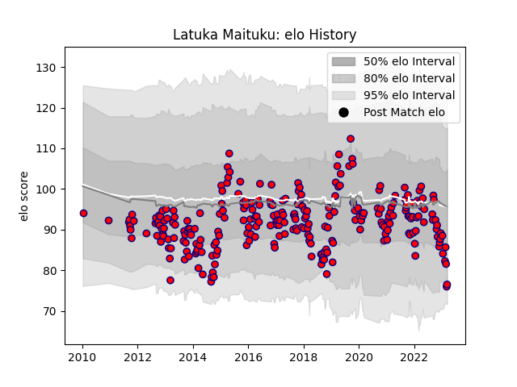

---  
layout: page  
title: Latuka Maituku  
date: 2023-01-13 11:37:33.818220  
categories: player  
---
# Latuka Maituku

## Positions: FL, N8

## Current elo: 89.0

## Current Percentile: 27.0

# Elo History

# Match History

| Team     |   Appearances |   Win Rate |
|:---------|--------------:|-----------:|
| Aurillac |           252 |   0.486111 |

| Opponent                   |   Matches |   Win Rate |
|:---------------------------|----------:|-----------:|
| Mont-de-Marsan             |        19 |   0.315789 |
| Beziers                    |        18 |   0.444444 |
| Carcassonne                |        18 |   0.722222 |
| Biarritz Olympique         |        12 |   0.5      |
| Vannes                     |        12 |   0.416667 |
| Narbonne                   |        11 |   0.636364 |
| Provence Rugby             |        11 |   0.545455 |
| Perpignan                  |        11 |   0.363636 |
| Colomiers                  |        11 |   0.454545 |
| Dax                        |        10 |   0.7      |
| Oyonnax                    |        10 |   0.4      |
| Montauban                  |        10 |   0.65     |
| Albi                       |        10 |   0.45     |
| Massy                      |         9 |   0.777778 |
| Agen                       |         8 |   0.5      |
| Bourgoin-Jallieu           |         7 |   0.5      |
| Nevers                     |         7 |   0.285714 |
| Soyaux-Angouleme           |         7 |   0.571429 |
| Grenoble                   |         6 |   0.333333 |
| Tarbes                     |         6 |   0.333333 |
| Bayonne                    |         6 |   0.166667 |
| Auch                       |         5 |   0.8      |
| US Bressane                |         5 |   0.6      |
| Lyon                       |         4 |   0.5      |
| La Rochelle                |         4 |   0.25     |
| Pau                        |         4 |   0        |
| Brive                      |         4 |   0.5      |
| Rouen                      |         4 |   0.5      |
| Valence Romans Drome Rugby |         2 |   0.5      |
| Roval Drome XV             |         1 |   0        |