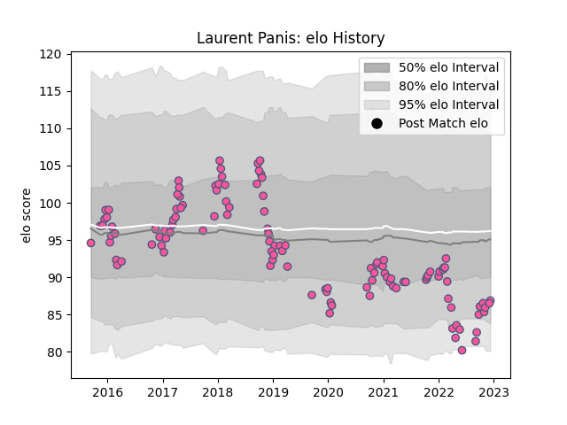

---  
layout: page  
title: Laurent Panis  
date: 2022-12-14 11:14:30.208969  
categories: player  
---
# Laurent Panis

## Positions: H

## Current elo: 87.0

## Current Percentile: 12.0

# Elo History

# Match History

| Team                 |   Appearances |   Win Rate |
|:---------------------|--------------:|-----------:|
| Stade Francais Paris |           115 |   0.469565 |

| Opponent            |   Matches |   Win Rate |
|:--------------------|----------:|-----------:|
| Pau                 |         9 |   0.555556 |
| Toulon              |         8 |   0.375    |
| Stade Toulousain    |         8 |   0.4375   |
| Montpellier Herault |         8 |   0.3125   |
| La Rochelle         |         7 |   0.285714 |
| Castres Olympique   |         7 |   0.428571 |
| Clermont Auvergne   |         7 |   0.285714 |
| Lyon                |         7 |   0.285714 |
| Bordeaux Begles     |         6 |   0.333333 |
| Brive               |         5 |   0.6      |
| Grenoble            |         4 |   0.5      |
| Racing 92           |         4 |   0.25     |
| Agen                |         4 |   0.75     |
| Perpignan           |         3 |   1        |
| Edinburgh           |         3 |   0.333333 |
| Ospreys             |         3 |   0.666667 |
| Benetton Treviso    |         3 |   1        |
| Oyonnax             |         2 |   0        |
| Leicester Tigers    |         2 |   0.5      |
| Bayonne             |         2 |   0.5      |
| Timisoara Saracens  |         2 |   1        |
| Munster             |         2 |   0.5      |
| Worcester Warriors  |         1 |   0        |
| Biarritz Olympique  |         1 |   1        |
| Harlequins          |         1 |   1        |
| Bristol Rugby       |         1 |   0        |
| Krasny Yar          |         1 |   1        |
| Gloucester Rugby    |         1 |   1        |
| London Irish        |         1 |   1        |
| Bath Rugby          |         1 |   1        |
| Zebre               |         1 |   0        |