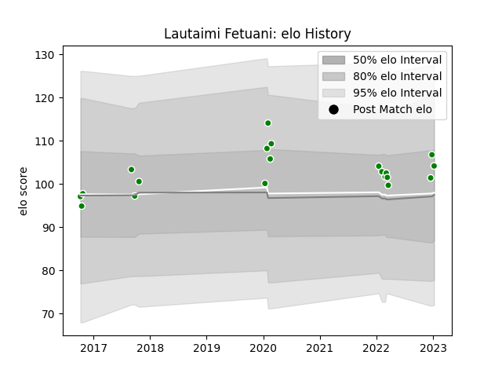

---  
layout: page  
title: Lautaimi Fetuani  
date: 2023-03-21 18:03:41.985154  
categories: player  
---
# Lautaimi Fetuani

Last updated: 2023-03-21
## Positions: N8, FL

## Current elo: 89.0

## Current Percentile: 22.0

# Elo History

# Match History

| Team            |   Appearances |   Win Rate |
|:----------------|--------------:|-----------:|
| Toyota Verblitz |            36 |   0.555556 |

| Opponent                          |   Matches |   Win Rate |
|:----------------------------------|----------:|-----------:|
| Saitama Wild Knights              |         4 |   0        |
| Toshiba Brave Lupus Tokyo         |         4 |   0.5      |
| Tokyo Sungoliath                  |         4 |   0.25     |
| Yokohama Canon Eagles             |         3 |   0.333333 |
| Kubota Spears Funabashi Tokyo-Bay |         3 |   0.666667 |
| Urayasu D-Rocks                   |         2 |   0.5      |
| Shizuoka Blue Revs                |         2 |   0.5      |
| Black Rams Tokyo                  |         2 |   0.5      |
| Mie Honda Heat                    |         2 |   1        |
| Hino Red Dolphins                 |         2 |   1        |
| Hanazono Kintetsu Liners          |         2 |   1        |
| Coca-Cola Red Sparks              |         1 |   1        |
| NTT Docomo Red Hurricanes Osaka   |         1 |   1        |
| Mitsubishi Dynaboars              |         1 |   0        |
| Toyota Industries Shuttles Aichi  |         1 |   1        |
| Green Rockets Tokatsu             |         1 |   1        |
| Munakata Sanix Blues              |         1 |   1        |