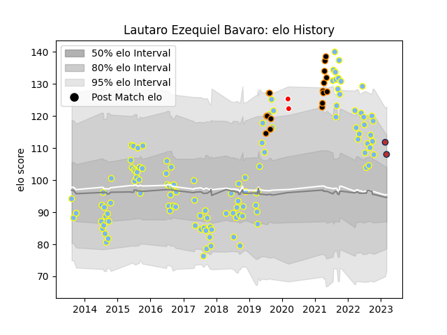

---  
layout: page  
title: Lautaro Ezequiel Bavaro  
date: 2023-03-09 10:10:15.025449  
categories: player  
---
# Lautaro Ezequiel Bavaro

## Positions: FL

## Current elo: 108.0

## Current Percentile: 87.0

# Elo History

# Match History

| Team         |   Appearances |   Win Rate |
|:-------------|--------------:|-----------:|
| Hindu        |           118 |    0.79661 |
| Jaguares XV  |            17 |    1       |
| Ceibos Rugby |             2 |    1       |
| Old Glory DC |             2 |    0.5     |

| Opponent             |   Matches |   Win Rate |
|:---------------------|----------:|-----------:|
| Belgrano             |        14 |   0.642857 |
| CUBA                 |        13 |   0.846154 |
| Alumni               |        11 |   0.772727 |
| Newman               |        11 |   0.454545 |
| San Luis             |         9 |   0.888889 |
| SIC                  |         9 |   0.666667 |
| Regatas Bella Vista  |         9 |   0.944444 |
| Pucara               |         9 |   0.833333 |
| Atlético del Rosario |         6 |   0.833333 |
| CASI                 |         6 |   0.833333 |
| La Plata             |         5 |   0.9      |
| Los Tilos            |         4 |   1        |
| Selknam              |         3 |   1        |
| Penarol Rugby        |         3 |   1        |
| Olimpia Lions        |         3 |   1        |
| Lomas                |         3 |   1        |
| Griffons             |         2 |   1        |
| Pueyrredón           |         2 |   1        |
| Cafeteros Pro        |         2 |   1        |
| Buenos Aires         |         2 |   1        |
| San Martin           |         2 |   1        |
| Valke                |         2 |   1        |
| Liceo Naval          |         1 |   1        |
| Manuel Belgrano      |         1 |   1        |
| Mariano Moreno       |         1 |   1        |
| Leopards             |         1 |   1        |
| Cobras               |         1 |   1        |
| Chicago Hounds       |         1 |   1        |
| Rugby New York       |         1 |   0        |
| Border Bulldogs      |         1 |   1        |
| Boland Cavaliers     |         1 |   1        |