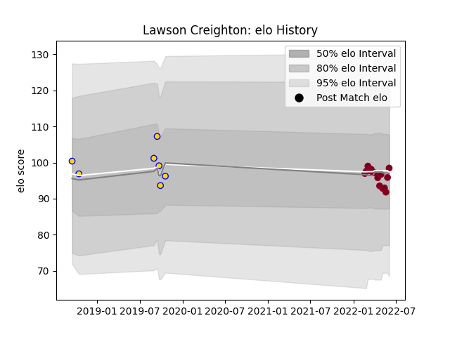

---  
layout: page  
title: Lawson Creighton  
date: 2023-03-02 11:23:08.655478  
categories: player  
---
# Lawson Creighton

## Positions: FH, FB

## Current elo: 98.0

## Current Percentile: 45.0

# Elo History

# Match History

| Team            |   Appearances |   Win Rate |
|:----------------|--------------:|-----------:|
| Queensland Reds |            15 |   0.533333 |
| Brisbane City   |             7 |   0.357143 |

| Opponent                 |   Matches |   Win Rate |
|:-------------------------|----------:|-----------:|
| Brumbies                 |         2 |       0.5  |
| Canberra Vikings         |         2 |       0    |
| Crusaders                |         2 |       0    |
| Fijian Drua              |         2 |       0.75 |
| Melbourne Rebels         |         2 |       1    |
| New South Wales Waratahs |         2 |       1    |
| Western Force            |         2 |       0.5  |
| Blues                    |         1 |       0    |
| Chiefs                   |         1 |       0    |
| Highlanders              |         1 |       0    |
| Hurricanes               |         1 |       0    |
| Moana Pasifika           |         1 |       1    |
| NSW Country Eagles       |         1 |       1    |
| Queensland Country       |         1 |       0    |
| Sydney Rays              |         1 |       1    |