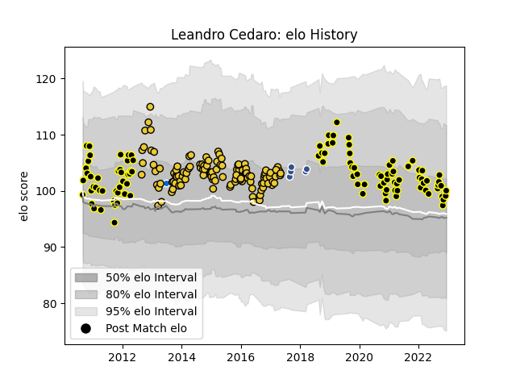

---  
layout: page  
title: Leandro Cedaro  
date: 2022-12-09 13:06:08.268373  
categories: player  
---
# Leandro Cedaro

## Positions: L

## Country: Italy

## Current elo: 99.0

## Current Percentile: 57.0

# Elo History

# Match History

| Team           |   Appearances |   Win Rate |
|:---------------|--------------:|-----------:|
| La Rochelle    |           121 |   0.557851 |
| Mont-de-Marsan |           101 |   0.584158 |
| Agen           |             5 |   0        |
| Italy          |             1 |   0        |

| Opponent                   |   Matches |   Win Rate |
|:---------------------------|----------:|-----------:|
| Oyonnax                    |        13 |   0.384615 |
| Grenoble                   |        12 |   0.583333 |
| Beziers                    |         9 |   0.666667 |
| Pau                        |         9 |   0.666667 |
| Colomiers                  |         9 |   0.666667 |
| Carcassonne                |         9 |   0.777778 |
| Aurillac                   |         8 |   0.75     |
| Bayonne                    |         8 |   0.6875   |
| Narbonne                   |         8 |   0.75     |
| Montpellier Herault        |         7 |   0.5      |
| Brive                      |         7 |   0.285714 |
| Clermont Auvergne          |         6 |   0.25     |
| Dax                        |         6 |   0.666667 |
| Toulon                     |         6 |   0.583333 |
| Bordeaux Begles            |         6 |   0.5      |
| Racing 92                  |         6 |   0.333333 |
| Lyon                       |         6 |   0.583333 |
| Provence Rugby             |         5 |   0.6      |
| Albi                       |         5 |   0.8      |
| Agen                       |         5 |   0.2      |
| Biarritz Olympique         |         5 |   0.5      |
| Rouen                      |         5 |   1        |
| Gloucester Rugby           |         4 |   0.25     |
| Soyaux-Angouleme           |         4 |   0.5      |
| Massy                      |         4 |   0.75     |
| Montauban                  |         4 |   0.25     |
| Vannes                     |         4 |   0.25     |
| Castres Olympique          |         4 |   0.5      |
| Stade Toulousain           |         4 |   0.75     |
| Stade Francais Paris       |         4 |   0.375    |
| Auch                       |         4 |   0.75     |
| Tarbes                     |         3 |   0.333333 |
| Nevers                     |         3 |   0        |
| Bourgoin-Jallieu           |         3 |   0.833333 |
| Valence Romans Drome Rugby |         2 |   0.75     |
| Worcester Warriors         |         2 |   0.5      |
| Mont-de-Marsan             |         2 |   0.5      |
| Périgueux                  |         2 |   1        |
| La Rochelle                |         2 |   0.5      |
| Exeter Chiefs              |         2 |   0        |
| Connacht                   |         2 |   0        |
| Benetton Treviso           |         2 |   1        |
| Zebre                      |         2 |   0.5      |
| Scotland                   |         1 |   0        |
| Saint-Etienne              |         1 |   1        |
| Perpignan                  |         1 |   0        |
| US Bressane                |         1 |   1        |
| Edinburgh                  |         1 |   1        |