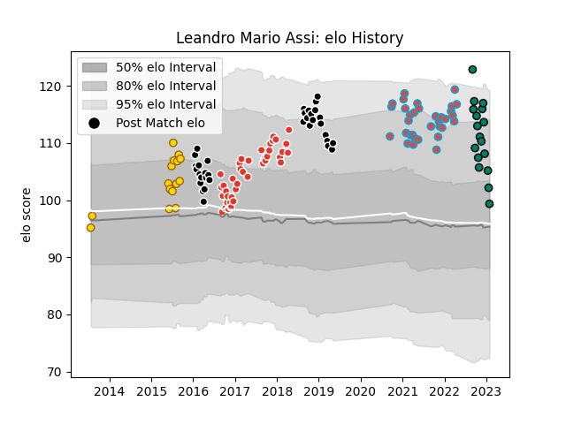

---  
layout: page  
title: Leandro Mario Assi  
date: 2023-03-21 18:05:16.564900  
categories: player  
---
# Leandro Mario Assi

Last updated: 2023-03-21
## Positions: P

## Current elo: 85.0

## Current Percentile: 40.0

# Elo History

# Match History

| Team               |   Appearances |   Win Rate |
|:-------------------|--------------:|-----------:|
| Biarritz Olympique |            40 |   0.575    |
| Provence Rugby     |            34 |   0.411765 |
| Bourgoin-Jallieu   |            33 |   0.454545 |
| Belgrano           |            21 |   0.666667 |
| Suresnes           |            21 |   0.333333 |

| Opponent                   |   Matches |   Win Rate |
|:---------------------------|----------:|-----------:|
| Dax                        |         9 |   0.222222 |
| Narbonne                   |         8 |   0.5      |
| Albi                       |         7 |   0.428571 |
| Colomiers                  |         7 |   0.428571 |
| Montauban                  |         5 |   0.4      |
| Aurillac                   |         5 |   0.6      |
| Beziers                    |         5 |   0.8      |
| Chambery                   |         5 |   0.6      |
| Carcassonne                |         5 |   0.4      |
| Massy                      |         4 |   0.5      |
| Mont-de-Marsan             |         4 |   0.75     |
| Cognac Saint Jean d'Angély |         4 |   0.75     |
| Nice                       |         4 |   0        |
| Perpignan                  |         4 |   0.75     |
| Bourgoin-Jallieu           |         4 |   0.75     |
| Blagnac                    |         4 |   0.5      |
| Tarbes                     |         4 |   0.75     |
| Bayonne                    |         4 |   0.5      |
| US Bressane                |         4 |   0.25     |
| Valence Romans Drome Rugby |         4 |   0.25     |
| Soyaux-Angouleme           |         3 |   0.333333 |
| Aubenas                    |         3 |   0.333333 |
| Vannes                     |         3 |   0        |
| Oyonnax                    |         2 |   0        |
| Suresnes                   |         2 |   0.5      |
| Nevers                     |         2 |   0.5      |
| Agen                       |         2 |   0.5      |
| Liceo Naval                |         2 |   0.5      |
| Atlético del Rosario       |         2 |   0.75     |
| Hindu                      |         2 |   0        |
| Grenoble                   |         2 |   0        |
| Dijon                      |         2 |   1        |
| Carqueiranne-Hyères        |         2 |   0.5      |
| CUBA                       |         2 |   0.5      |
| Brive                      |         2 |   0.5      |
| SIC                        |         1 |   1        |
| Alumni                     |         1 |   1        |
| Biarritz Olympique         |         1 |   0        |
| Buenos Aires               |         1 |   1        |
| San Martin                 |         1 |   1        |
| San Luis                   |         1 |   1        |
| Lyon                       |         1 |   0        |
| Rennes                     |         1 |   1        |
| Regatas Bella Vista        |         1 |   1        |
| Manuel Belgrano            |         1 |   1        |
| Pucara                     |         1 |   1        |
| CASI                       |         1 |   1        |
| Newman                     |         1 |   0.5      |
| La Plata                   |         1 |   0        |
| Lomas                      |         1 |   0        |
| Pueyrredón                 |         1 |   1        |