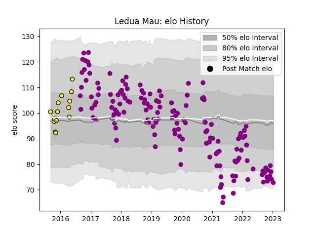

---  
layout: page  
title: Ledua Mau  
date: 2023-02-02 18:43:31.818422  
categories: player  
---
# Ledua Mau

## Positions: C, W

## Current elo: 65.0

## Current Percentile: 3.0

# Elo History

# Match History

| Team             |   Appearances |   Win Rate |
|:-----------------|--------------:|-----------:|
| Soyaux-Angouleme |           153 |   0.503268 |
| Albi             |            14 |   0.428571 |

| Opponent                   |   Matches |   Win Rate |
|:---------------------------|----------:|-----------:|
| Mont-de-Marsan             |        11 |   0.454545 |
| Colomiers                  |        11 |   0.454545 |
| Montauban                  |        10 |   0.35     |
| Beziers                    |        10 |   0.7      |
| Biarritz Olympique         |        10 |   0.5      |
| Vannes                     |         9 |   0.555556 |
| Carcassonne                |         9 |   0.5      |
| Perpignan                  |         8 |   0.125    |
| Aurillac                   |         7 |   0.714286 |
| Nevers                     |         7 |   0.357143 |
| Oyonnax                    |         6 |   0        |
| Dax                        |         6 |   0.5      |
| Provence Rugby             |         6 |   0.833333 |
| Massy                      |         6 |   0.583333 |
| Rouen                      |         6 |   0.333333 |
| Bourgoin-Jallieu           |         4 |   1        |
| Bayonne                    |         4 |   0.5      |
| Grenoble                   |         4 |   0.25     |
| Narbonne                   |         4 |   0.75     |
| Tarbes                     |         3 |   0.666667 |
| Albi                       |         3 |   0.666667 |
| US Bressane                |         2 |   0.5      |
| Roval Drome XV             |         2 |   0.5      |
| Valence Romans Drome Rugby |         2 |   1        |
| Agen                       |         2 |   0.5      |
| Nice                       |         2 |   0.5      |
| Dijon                      |         2 |   0.5      |
| Cognac Saint Jean d'Angély |         2 |   1        |
| Chambery                   |         2 |   0        |
| Brive                      |         2 |   0        |
| Lyon                       |         2 |   0        |
| Suresnes                   |         1 |   1        |
| Blagnac                    |         1 |   1        |
| Aubenas                    |         1 |   1        |