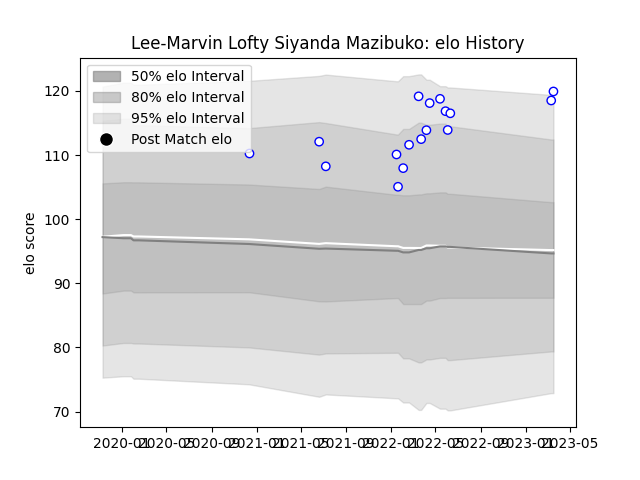

---  
layout: page  
title: Lee-Marvin Lofty Siyanda Mazibuko  
date: 2023-03-21 17:58:47.372639  
categories: player  
---
# Lee-Marvin Lofty Siyanda Mazibuko

Last updated: 2023-03-21
## Positions: P

## Current elo: 120.0

## Current Percentile: 94.0

# Elo History

# Match History

| Team               |   Appearances |   Win Rate |
|:-------------------|--------------:|-----------:|
| Western Province   |            17 |   0.411765 |
| Rugby Viadana 1970 |             6 |   0.583333 |

| Opponent                 |   Matches |   Win Rate |
|:-------------------------|----------:|-----------:|
| Blue Bulls               |         4 |   0.5      |
| Golden Lions             |         3 |   0.666667 |
| Griquas                  |         3 |   0        |
| Pumas                    |         3 |   0.666667 |
| Free State Cheetahs      |         2 |   0        |
| Natal Sharks             |         2 |   0.5      |
| I Medicei                |         1 |   0        |
| Kawasaki Robot Calvisano |         1 |   1        |
| Lafert San Dona          |         1 |   0.5      |
| Lazio Rugby              |         1 |   1        |
| Petrarca Padova Rugby    |         1 |   0        |
| Valorugby Emilia         |         1 |   1        |