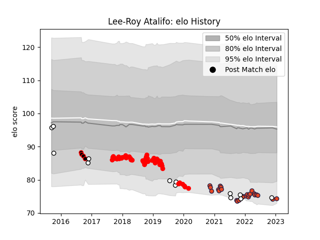

---  
layout: page  
title: Lee-Roy Atalifo  
date: 2023-01-17 11:40:14.958024  
categories: player  
---
# Lee-Roy Atalifo

## Positions: P

## Country: Fiji

## Current elo: 74.0

## Current Percentile: 7.0

# Elo History

# Match History

| Team       |   Appearances |   Win Rate |
|:-----------|--------------:|-----------:|
| Jersey     |            47 |   0.56383  |
| Edinburgh  |            25 |   0.44     |
| Fiji       |            13 |   0.384615 |
| Canterbury |             4 |   0.75     |

| Opponent            |   Matches |   Win Rate |
|:--------------------|----------:|-----------:|
| Cornish Pirates     |         5 |   0.8      |
| Hartpury College    |         5 |   0.8      |
| Nottingham          |         5 |   0.7      |
| Richmond            |         4 |   0.75     |
| Bedford             |         4 |   0.5      |
| Yorkshire Carnegie  |         4 |   0.5      |
| Doncaster           |         4 |   0.75     |
| Ealing Trailfinders |         3 |   0        |
| London Scottish     |         3 |   0.333333 |
| Benetton Treviso    |         3 |   0.333333 |
| London Irish        |         3 |   0.333333 |
| Rotherham Titans    |         2 |   1        |
| Leinster            |         2 |   0        |
| Scarlets            |         2 |   0.5      |
| Ulster              |         2 |   0        |
| Uruguay             |         2 |   0.5      |
| Newcastle Falcons   |         2 |   0        |
| New Zealand         |         2 |   0        |
| Munster             |         2 |   0        |
| Wales               |         2 |   0        |
| Zebre               |         2 |   1        |
| Cardiff Blues       |         2 |   0.5      |
| Coventry            |         2 |   0        |
| Connacht            |         2 |   1        |
| Japan               |         1 |   1        |
| Saracens            |         1 |   1        |
| Bristol Rugby       |         1 |   0        |
| Canada              |         1 |   1        |
| Castres Olympique   |         1 |   1        |
| Tasman              |         1 |   1        |
| Stormers            |         1 |   0        |
| Spain               |         1 |   1        |
| Sharks              |         1 |   1        |
| Counties Manukau    |         1 |   0        |
| Ireland             |         1 |   0        |
| Otago               |         1 |   1        |
| Ospreys             |         1 |   0        |
| Dragons             |         1 |   0        |
| Northland           |         1 |   1        |
| England             |         1 |   0        |
| New Zealand Maori   |         1 |   0        |
| Georgia             |         1 |   1        |
| Glasgow Warriors    |         1 |   1        |
| Ampthill            |         1 |   1        |