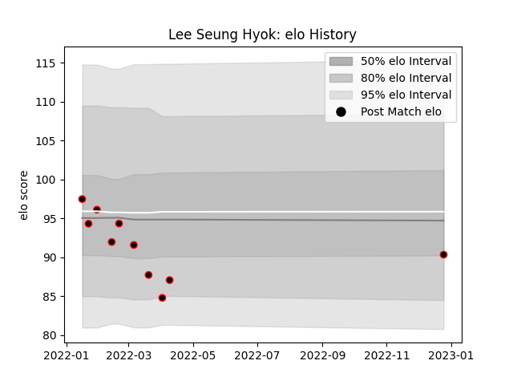

---  
layout: page  
title: Lee Seung Hyok  
date: 2022-12-28 12:54:50.165633  
categories: player  
---
# Lee Seung Hyok

## Positions: H

## Current elo: 90.0

## Current Percentile: 10.0

# Elo History

# Match History

| Team           |   Appearances |   Win Rate |
|:---------------|--------------:|-----------:|
| Mie Honda Heat |            10 |        0.7 |

| Opponent                 |   Matches |   Win Rate |
|:-------------------------|----------:|-----------:|
| Kamaishi Seawaves        |         3 |        1   |
| Hanazono Kintetsu Liners |         2 |        0   |
| Hino Red Dolphins        |         2 |        1   |
| Mitsubishi Dynaboars     |         2 |        0.5 |
| Skyactivs Hiroshima      |         1 |        1   |