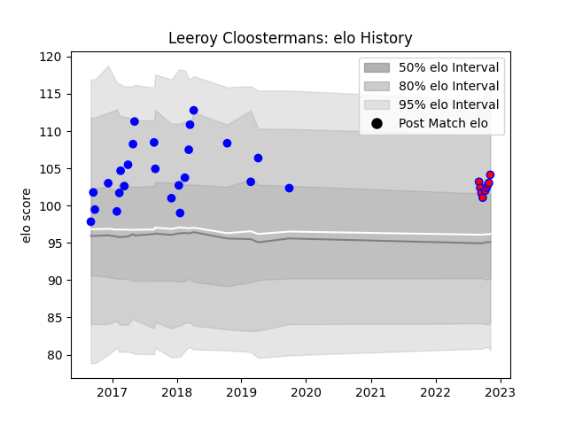

---  
layout: page  
title: Leeroy Cloostermans  
date: 2023-03-27 11:35:37.217102  
categories: player  
---
# Leeroy Cloostermans

Last updated: 2023-03-27
## Positions: H

## Current elo: 118.0

## Current Percentile: 94.0

# Elo History

# Match History

| Team    |   Appearances |   Win Rate |
|:--------|--------------:|-----------:|
| Vannes  |            72 |   0.479167 |
| Blagnac |            11 |   0.681818 |

| Opponent                   |   Matches |   Win Rate |
|:---------------------------|----------:|-----------:|
| Aurillac                   |         6 |   0.5      |
| Soyaux-Angouleme           |         6 |   0.5      |
| Biarritz Olympique         |         5 |   0.6      |
| Carcassonne                |         5 |   0.2      |
| Massy                      |         4 |   0.75     |
| Beziers                    |         4 |   0.5      |
| Narbonne                   |         4 |   0.625    |
| Montauban                  |         4 |   0.5      |
| Mont-de-Marsan             |         4 |   0.5      |
| Perpignan                  |         4 |   0.25     |
| Colomiers                  |         4 |   0.75     |
| Dax                        |         4 |   0.25     |
| Provence Rugby             |         3 |   0.333333 |
| Nevers                     |         3 |   0.333333 |
| US Bressane                |         3 |   0.5      |
| Oyonnax                    |         3 |   0.333333 |
| Albi                       |         2 |   1        |
| Carqueiranne-Hyères        |         2 |   1        |
| Brive                      |         2 |   0        |
| Bourgoin-Jallieu           |         2 |   0.75     |
| Bayonne                    |         2 |   0.5      |
| Agen                       |         1 |   0.5      |
| Tarbes                     |         1 |   1        |
| Grenoble                   |         1 |   0        |
| Rennes                     |         1 |   1        |
| Cognac Saint Jean d'Angély |         1 |   1        |
| Chambery                   |         1 |   1        |
| Valence Romans Drome Rugby |         1 |   0        |