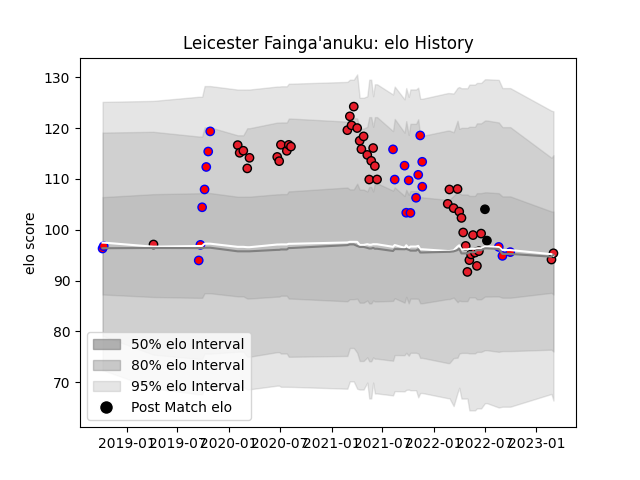

---  
layout: page  
title: Leicester Fainga'anuku  
date: 2023-03-17 17:26:21.761697  
categories: player  
---
# Leicester Fainga'anuku

## Positions: W, C

## Country: New Zealand

## Current elo: 95.0

## Current Percentile: 47.0

# Elo History

# Match History

| Team        |   Appearances |   Win Rate |
|:------------|--------------:|-----------:|
| Crusaders   |            44 |   0.818182 |
| Tasman      |            23 |   0.695652 |
| New Zealand |             2 |   0.5      |

| Opponent                 |   Matches |   Win Rate |
|:-------------------------|----------:|-----------:|
| Chiefs                   |        10 |   0.6      |
| Highlanders              |         8 |   0.875    |
| Hurricanes               |         6 |   0.833333 |
| Hawke's Bay              |         5 |   0.6      |
| Blues                    |         4 |   0.75     |
| Waikato                  |         4 |   0.25     |
| Queensland Reds          |         4 |   1        |
| Auckland                 |         3 |   1        |
| New South Wales Waratahs |         3 |   0.666667 |
| Brumbies                 |         3 |   1        |
| Wellington               |         2 |   1        |
| Northland                |         2 |   1        |
| North Harbour            |         2 |   0.5      |
| Western Force            |         2 |   1        |
| Melbourne Rebels         |         2 |   1        |
| Ireland                  |         2 |   0.5      |
| Bay of Plenty            |         1 |   1        |
| Otago                    |         1 |   1        |
| Southland                |         1 |   1        |
| Sunwolves                |         1 |   1        |
| Fijian Drua              |         1 |   1        |
| Canterbury               |         1 |   0        |
| Manawatu                 |         1 |   1        |