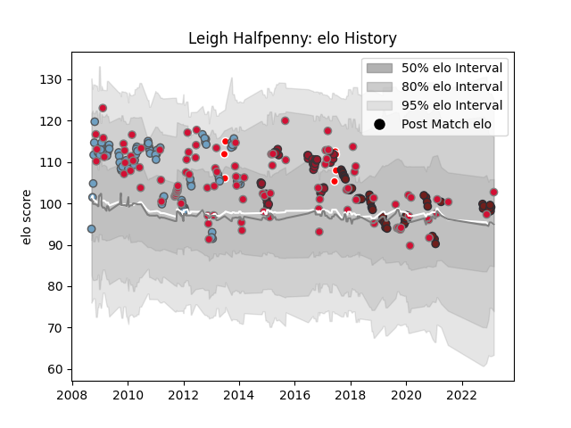

---  
layout: page  
title: Leigh Halfpenny  
date: 2023-01-06 00:19:53.939079  
categories: player  
---
# Leigh Halfpenny

## Positions: FB, W

## Country: Wales

## Current elo: 100.0

## Current Percentile: 30.0

# Elo History

# Match History

| Team                    |   Appearances |   Win Rate |
|:------------------------|--------------:|-----------:|
| Wales                   |            97 |   0.525773 |
| Cardiff Blues           |            85 |   0.564706 |
| Scarlets                |            48 |   0.583333 |
| Toulon                  |            40 |   0.7      |
| British and Irish Lions |             7 |   0.5      |

| Opponent             |   Matches |   Win Rate |
|:---------------------|----------:|-----------:|
| Australia            |        15 |   0.2      |
| Ireland              |        13 |   0.538462 |
| France               |        13 |   0.461538 |
| Edinburgh            |        12 |   0.5      |
| Ospreys              |        11 |   0.5      |
| Scotland             |        10 |   0.8      |
| Dragons              |         9 |   0.666667 |
| Leinster             |         9 |   0.222222 |
| Italy                |         9 |   1        |
| Toulon               |         9 |   0.333333 |
| England              |         9 |   0.444444 |
| Scarlets             |         8 |   0.5      |
| New Zealand          |         8 |   0        |
| South Africa         |         8 |   0.375    |
| Cardiff Blues        |         8 |   0.5      |
| Glasgow Warriors     |         7 |   0.428571 |
| Sale Sharks          |         7 |   0.714286 |
| Ulster               |         7 |   0.714286 |
| Connacht             |         6 |   0.666667 |
| Stade Toulousain     |         6 |   0.666667 |
| Racing 92            |         6 |   0.5      |
| Benetton Treviso     |         6 |   0.833333 |
| Munster              |         6 |   0.5      |
| Castres Olympique    |         5 |   0.8      |
| Leicester Tigers     |         4 |   0.625    |
| Argentina            |         4 |   0.75     |
| Zebre                |         4 |   0.75     |
| Montpellier Herault  |         3 |   0.666667 |
| Cheetahs             |         3 |   1        |
| Gloucester Rugby     |         3 |   1        |
| Samoa                |         3 |   0.666667 |
| Clermont Auvergne    |         3 |   0.666667 |
| Bayonne              |         3 |   0.666667 |
| Canada               |         2 |   1        |
| Pau                  |         2 |   1        |
| Saracens             |         2 |   0        |
| Exeter Chiefs        |         2 |   0        |
| Biarritz Olympique   |         2 |   1        |
| La Rochelle          |         2 |   1        |
| Stade Francais Paris |         2 |   0        |
| London Irish         |         2 |   1        |
| Bordeaux Begles      |         2 |   1        |
| Georgia              |         2 |   0.5      |
| Calvisano            |         2 |   1        |
| Uruguay              |         1 |   1        |
| Southern Kings       |         1 |   1        |
| Wasps                |         1 |   1        |
| Tonga                |         1 |   1        |
| Aironi               |         1 |   1        |
| Oyonnax              |         1 |   1        |
| Northampton Saints   |         1 |   1        |
| New Zealand Maori    |         1 |   1        |
| Namibia              |         1 |   1        |
| Lyon                 |         1 |   1        |
| Hurricanes           |         1 |   0.5      |
| Harlequins           |         1 |   1        |
| Grenoble             |         1 |   1        |
| Fiji                 |         1 |   1        |
| Brive                |         1 |   0        |
| Blues                |         1 |   0        |
| Bath Rugby           |         1 |   0        |
| Japan                |         1 |   1        |