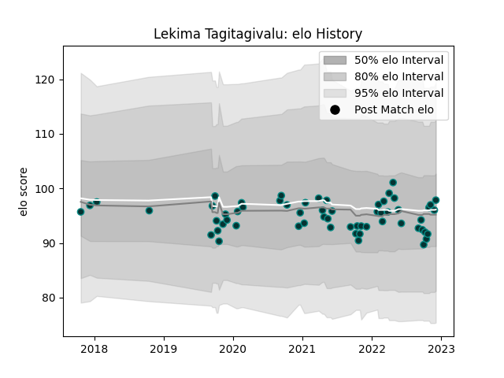

---  
layout: page  
title: Lekima Tagitagivalu  
date: 2022-12-09 13:14:08.498895  
categories: player  
---
# Lekima Tagitagivalu

## Positions: FL, L

## Current elo: 98.0

## Current Percentile: 54.0

# Elo History

# Match History

| Team   |   Appearances |   Win Rate |
|:-------|--------------:|-----------:|
| Pau    |            60 |        0.5 |

| Opponent             |   Matches |   Win Rate |
|:---------------------|----------:|-----------:|
| Castres Olympique    |         5 |   0.2      |
| Clermont Auvergne    |         5 |   0.4      |
| Agen                 |         4 |   1        |
| Toulon               |         4 |   0.125    |
| Stade Toulousain     |         4 |   0.5      |
| Stade Francais Paris |         4 |   0.25     |
| Racing 92            |         4 |   0        |
| Lyon                 |         4 |   0.375    |
| Montpellier Herault  |         4 |   0.5      |
| Bordeaux Begles      |         3 |   0.666667 |
| La Rochelle          |         3 |   0.333333 |
| Bayonne              |         3 |   1        |
| Perpignan            |         2 |   1        |
| Zebre                |         2 |   1        |
| Brive                |         2 |   0.5      |
| Biarritz Olympique   |         2 |   1        |
| Ospreys              |         1 |   0        |
| Leicester Tigers     |         1 |   1        |
| Calvisano            |         1 |   1        |
| Worcester Warriors   |         1 |   1        |
| London Irish         |         1 |   0        |