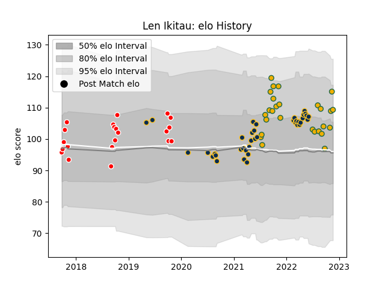

---  
layout: page  
title: Len Ikitau  
date: 2023-03-17 17:40:34.017383  
categories: player  
---
# Len Ikitau

## Positions: C

## Country: Australia

## Current elo: 115.0

## Current Percentile: 90.0

# Elo History

# Match History

| Team             |   Appearances |   Win Rate |
|:-----------------|--------------:|-----------:|
| Brumbies         |            41 |   0.658537 |
| Australia        |            28 |   0.464286 |
| Canberra Vikings |            21 |   0.666667 |

| Opponent                 |   Matches |   Win Rate |
|:-------------------------|----------:|-----------:|
| Western Force            |         9 |   0.777778 |
| Queensland Reds          |         8 |   0.375    |
| Fijian Drua              |         7 |   0.714286 |
| New Zealand              |         5 |   0        |
| New South Wales Waratahs |         5 |   1        |
| Argentina                |         5 |   0.8      |
| Melbourne Rebels         |         5 |   0.8      |
| Blues                    |         4 |   0.5      |
| South Africa             |         4 |   0.75     |
| France                   |         4 |   0.5      |
| Sydney Rays              |         3 |   1        |
| England                  |         3 |   0.333333 |
| Hurricanes               |         3 |   1        |
| Highlanders              |         3 |   0.333333 |
| NSW Country Eagles       |         3 |   0.666667 |
| Melbourne Rising         |         2 |   1        |
| Crusaders                |         2 |   0        |
| Chiefs                   |         2 |   0.5      |
| Queensland Country       |         2 |   0        |
| Scotland                 |         2 |   0.5      |
| Wales                    |         2 |   0.5      |
| Italy                    |         1 |   0        |
| Japan                    |         1 |   1        |
| Ireland                  |         1 |   0        |
| Moana Pasifika           |         1 |   0        |
| Perth Spirit             |         1 |   1        |
| Brisbane City            |         1 |   1        |
| Greater Sydney Rams      |         1 |   1        |