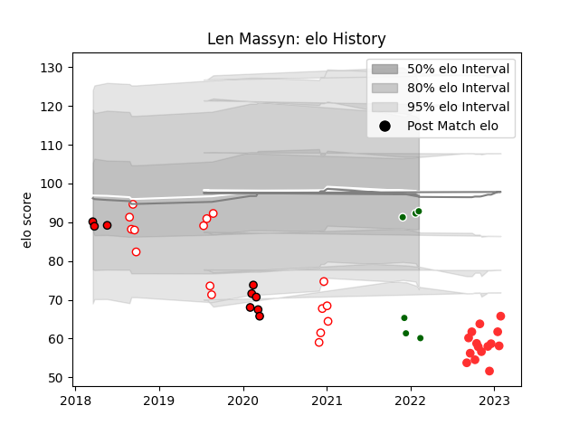

---  
layout: page  
title: Len Massyn  
date: 2022-12-18 16:14:52.425774  
categories: player  
---
# Len Massyn

## Positions: N8, FL

## Current elo: 77.0

## Current Percentile: 6.0

# Elo History

# Match History

| Team                |   Appearances |   Win Rate |
|:--------------------|--------------:|-----------:|
| Golden Lions        |            13 |   0.615385 |
| Tarbes              |            11 |   0.363636 |
| Lions               |             9 |   0.333333 |
| Ealing Trailfinders |             3 |   0.666667 |

| Opponent                   |   Matches |   Win Rate |
|:---------------------------|----------:|-----------:|
| Natal Sharks               |         3 |   0.333333 |
| Blue Bulls                 |         3 |   0.333333 |
| Western Province           |         2 |   0.5      |
| Free State Cheetahs        |         2 |   1        |
| Griquas                    |         2 |   1        |
| Jaguares                   |         2 |   0        |
| US Bressane                |         1 |   0        |
| Suresnes                   |         1 |   0        |
| Sunwolves                  |         1 |   1        |
| Stormers                   |         1 |   0        |
| Richmond                   |         1 |   1        |
| Rennes                     |         1 |   1        |
| Queensland Reds            |         1 |   1        |
| Pumas                      |         1 |   1        |
| Nice                       |         1 |   0        |
| New South Wales Waratahs   |         1 |   0        |
| Ampthill                   |         1 |   1        |
| Narbonne                   |         1 |   1        |
| Bedford                    |         1 |   0        |
| Dax                        |         1 |   0        |
| Cognac Saint Jean d'Angély |         1 |   1        |
| Chambery                   |         1 |   0        |
| Carqueiranne-Hyères        |         1 |   0        |
| Brumbies                   |         1 |   1        |
| Bourgoin-Jallieu           |         1 |   1        |
| Blues                      |         1 |   0        |
| Blagnac                    |         1 |   0        |
| Melbourne Rebels           |         1 |   0        |