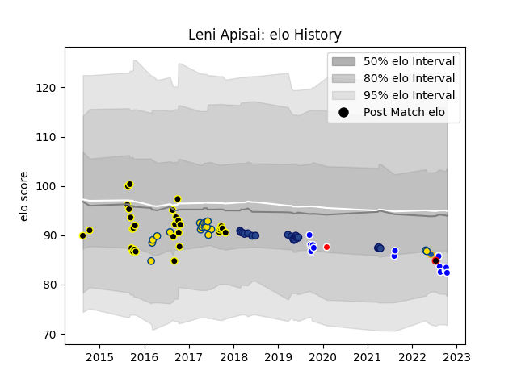

---  
layout: page  
title: Leni Apisai  
date: 2023-03-17 17:25:06.628186  
categories: player  
---
# Leni Apisai

## Positions: H

## Country: New Zealand Maori

## Current elo: 82.0

## Current Percentile: 17.0

# Elo History

# Match History

| Team              |   Appearances |   Win Rate |
|:------------------|--------------:|-----------:|
| Wellington        |            30 |   0.616667 |
| Blues             |            19 |   0.236842 |
| Hurricanes        |            18 |   0.694444 |
| Auckland          |            14 |   0.571429 |
| Highlanders       |             1 |   0        |
| New Zealand Maori |             1 |   0        |
| Sunwolves         |             1 |   1        |

| Opponent                 |   Matches |   Win Rate |
|:-------------------------|----------:|-----------:|
| North Harbour            |         6 |   0.833333 |
| Tasman                   |         5 |   0        |
| Chiefs                   |         5 |   0.4      |
| Highlanders              |         5 |   0.2      |
| Bay of Plenty            |         4 |   0.75     |
| Queensland Reds          |         4 |   0.75     |
| Brumbies                 |         4 |   0.25     |
| Waikato                  |         4 |   0.5      |
| Taranaki                 |         4 |   0.75     |
| Southland                |         4 |   1        |
| Hawke's Bay              |         4 |   0.625    |
| Otago                    |         4 |   0.5      |
| Blues                    |         3 |   0.666667 |
| Melbourne Rebels         |         3 |   0.666667 |
| Hurricanes               |         3 |   0.333333 |
| Wellington               |         2 |   0        |
| Stormers                 |         2 |   0.5      |
| Manawatu                 |         2 |   0        |
| Crusaders                |         2 |   0        |
| Counties Manukau         |         2 |   1        |
| Canterbury               |         2 |   1        |
| Bulls                    |         2 |   0.75     |
| New South Wales Waratahs |         1 |   1        |
| Northland                |         1 |   1        |
| Jaguares                 |         1 |   0        |
| Ireland                  |         1 |   0        |
| Sharks                   |         1 |   0        |
| Cheetahs                 |         1 |   1        |
| British and Irish Lions  |         1 |   0.5      |
| Western Force            |         1 |   1        |