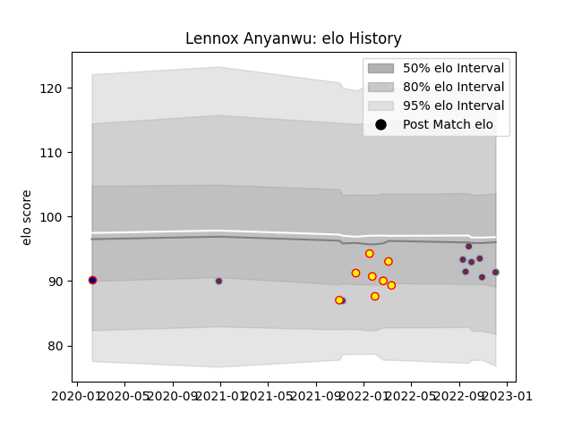

---  
layout: page  
title: Lennox Anyanwu  
date: 2023-03-21 18:42:41.628666  
categories: player  
---
# Lennox Anyanwu

Last updated: 2023-03-21
## Positions: C

## Current elo: 100.0

## Current Percentile: 16.0

# Elo History

# Match History

| Team            |   Appearances |   Win Rate |
|:----------------|--------------:|-----------:|
| Richmond        |            12 |   0.5      |
| Harlequins      |             9 |   0.666667 |
| London Scottish |             1 |   0        |

| Opponent            |   Matches |   Win Rate |
|:--------------------|----------:|-----------:|
| Nottingham          |         3 |   0.666667 |
| Jersey              |         2 |   0        |
| Hartpury College    |         2 |   0.5      |
| London Scottish     |         2 |   1        |
| London Irish        |         1 |   1        |
| Saracens            |         1 |   0        |
| Sale Sharks         |         1 |   1        |
| Northampton Saints  |         1 |   1        |
| Newcastle Falcons   |         1 |   1        |
| Ampthill            |         1 |   0        |
| Bath Rugby          |         1 |   1        |
| Exeter Chiefs       |         1 |   0        |
| Ealing Trailfinders |         1 |   0        |
| Coventry            |         1 |   0        |
| Bristol Rugby       |         1 |   0        |
| Bedford             |         1 |   1        |
| Wasps               |         1 |   1        |