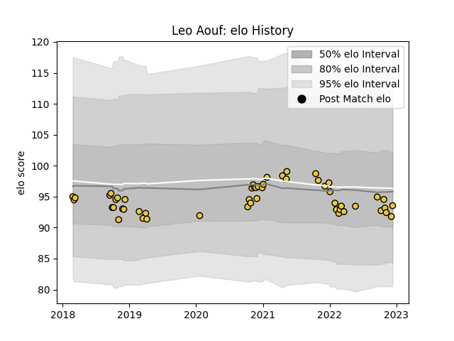

---  
layout: page  
title: Leo Aouf  
date: 2022-12-09 13:05:49.057468  
categories: player  
---
# Leo Aouf

## Positions: P

## Current elo: 92.0

## Current Percentile: 35.0

# Elo History

# Match History

| Team        |   Appearances |   Win Rate |
|:------------|--------------:|-----------:|
| La Rochelle |            51 |   0.568627 |

| Opponent             |   Matches |   Win Rate |
|:---------------------|----------:|-----------:|
| Stade Francais Paris |         6 |   0.333333 |
| Brive                |         5 |   0.8      |
| Lyon                 |         4 |   0.75     |
| Pau                  |         4 |   0.5      |
| Clermont Auvergne    |         4 |   0.75     |
| Bayonne              |         3 |   0.666667 |
| Perpignan            |         3 |   0.666667 |
| Montpellier Herault  |         3 |   0.333333 |
| Agen                 |         3 |   0.666667 |
| Castres Olympique    |         3 |   0.333333 |
| Toulon               |         3 |   0.333333 |
| Bristol Rugby        |         2 |   1        |
| Bordeaux Begles      |         2 |   0.5      |
| Racing 92            |         2 |   1        |
| Exeter Chiefs        |         1 |   0        |
| RC Enisei            |         1 |   1        |
| Biarritz Olympique   |         1 |   0        |
| Stade Toulousain     |         1 |   0        |