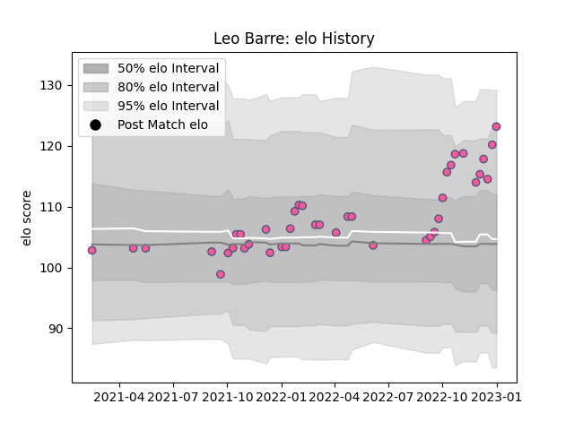

---  
layout: page  
title: Leo Barre  
date: 2022-12-14 11:18:00.571001  
categories: player  
---
# Leo Barre

## Positions: FH, C

## Current elo: 105.0

## Current Percentile: 69.0

# Elo History

# Match History

| Team                 |   Appearances |   Win Rate |
|:---------------------|--------------:|-----------:|
| Stade Francais Paris |            37 |        0.5 |

| Opponent            |   Matches |   Win Rate |
|:--------------------|----------:|-----------:|
| Pau                 |         4 |   0.75     |
| Brive               |         3 |   0.333333 |
| Clermont Auvergne   |         3 |   0.666667 |
| Lyon                |         3 |   0.333333 |
| Montpellier Herault |         3 |   0.333333 |
| Perpignan           |         3 |   1        |
| Toulon              |         3 |   0.333333 |
| Bordeaux Begles     |         2 |   0        |
| Castres Olympique   |         2 |   0        |
| Connacht            |         2 |   0.5      |
| La Rochelle         |         2 |   1        |
| Racing 92           |         2 |   0        |
| Stade Toulousain    |         2 |   0.75     |
| Bayonne             |         1 |   1        |
| Benetton Treviso    |         1 |   1        |
| Bristol Rugby       |         1 |   0        |