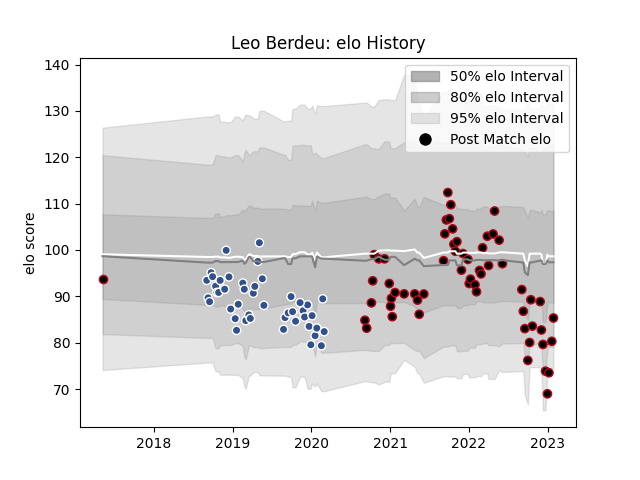

---  
layout: page  
title: Leo Berdeu  
date: 2023-01-06 00:15:22.114200  
categories: player  
---
# Leo Berdeu

## Positions: FH

## Current elo: 85.0

## Current Percentile: 9.0

# Elo History

# Match History

| Team   |   Appearances |   Win Rate |
|:-------|--------------:|-----------:|
| Lyon   |            56 |   0.508929 |
| Agen   |            45 |   0.344444 |

| Opponent             |   Matches |   Win Rate |
|:---------------------|----------:|-----------:|
| Bordeaux Begles      |         9 |   0.333333 |
| Brive                |         8 |   0.75     |
| Castres Olympique    |         8 |   0.25     |
| Montpellier Herault  |         8 |   0.625    |
| Toulon               |         7 |   0.142857 |
| Clermont Auvergne    |         7 |   0.285714 |
| La Rochelle          |         7 |   0.285714 |
| Pau                  |         6 |   0.416667 |
| Racing 92            |         6 |   0.166667 |
| Stade Francais Paris |         5 |   0.4      |
| Bayonne              |         5 |   0.6      |
| Stade Toulousain     |         4 |   0.5      |
| Grenoble             |         4 |   0.625    |
| Perpignan            |         4 |   1        |
| Agen                 |         2 |   1        |
| Harlequins           |         2 |   0        |
| Lyon                 |         2 |   0.5      |
| Biarritz Olympique   |         2 |   1        |
| Benetton Treviso     |         2 |   0.5      |
| Edinburgh            |         1 |   0        |
| Bulls                |         1 |   0        |
| Wasps                |         1 |   0        |