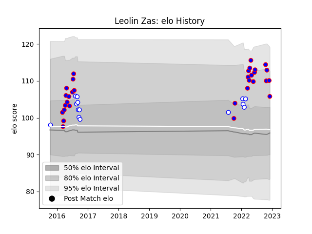

---  
layout: page  
title: Leolin Zas  
date: 2022-12-14 11:13:42.293468  
categories: player  
---
# Leolin Zas

## Positions: W

## Current elo: 103.0

## Current Percentile: 80.0

# Elo History

# Match History

| Team             |   Appearances |   Win Rate |
|:-----------------|--------------:|-----------:|
| Stormers         |            32 |   0.734375 |
| Western Province |            14 |   0.571429 |

| Opponent                 |   Matches |   Win Rate |
|:-------------------------|----------:|-----------:|
| Blue Bulls               |         2 |       0    |
| Ospreys                  |         2 |       0.75 |
| Bulls                    |         2 |       0.5  |
| Cardiff Blues            |         2 |       0.5  |
| Cheetahs                 |         2 |       1    |
| Ulster                   |         2 |       1    |
| Lions                    |         2 |       0.5  |
| Dragons                  |         2 |       1    |
| Eastern Province Kings   |         2 |       1    |
| Natal Sharks             |         2 |       0.5  |
| Pumas                    |         2 |       1    |
| Scarlets                 |         2 |       1    |
| Golden Lions             |         2 |       0.5  |
| Griquas                  |         2 |       0.5  |
| Queensland Reds          |         1 |       1    |
| Southern Kings           |         1 |       1    |
| Sharks                   |         1 |       0    |
| Sunwolves                |         1 |       1    |
| Western Force            |         1 |       1    |
| New South Wales Waratahs |         1 |       0    |
| Leinster                 |         1 |       1    |
| Munster                  |         1 |       0    |
| Melbourne Rebels         |         1 |       1    |
| Boland Cavaliers         |         1 |       1    |
| Jaguares                 |         1 |       1    |
| Glasgow Warriors         |         1 |       1    |
| Free State Cheetahs      |         1 |       0    |
| Edinburgh                |         1 |       1    |
| Clermont Auvergne        |         1 |       0    |
| Chiefs                   |         1 |       0    |
| Brumbies                 |         1 |       1    |
| Zebre                    |         1 |       1    |